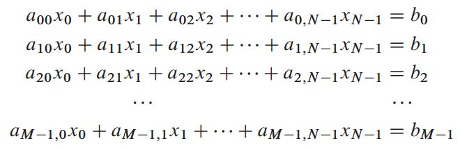
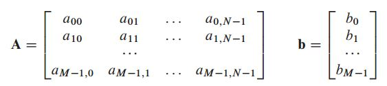
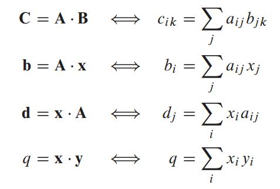

# 数值分析方法 

## 线性代数求解
*线性方程 N个未知数 M个方程

当 独立方程个数 等于未知数个数N时，方程有唯一解; 当 部分方程可以被其他方程线性表示时，出现行退化，方程数少于未知变量个数，出现奇异性(多解)；当所有的方程的 某些未知变量约束线性相关时，出现列退化，即实际 未知数量减少。
*矩阵形式

系数矩阵 A , 右侧 工程量 b 为列向量
*A * x = b

**矩阵向量乘法

分别为：
矩阵A * 矩阵B 结果为矩阵; 
矩阵A * 向量x 结果为向量; 
向量x * 矩阵A 结果为向量; 
向量x * 向量y 值为常量
