# 参考

[程序员的数学3册 数学思维 概率论 线代csdn下载](https://download.csdn.net/download/starstars/10216368)

[程序员的数学3册笔记](https://github.com/Ewenwan/book-note/tree/master/books/mathematics)

[latex在线可视化编辑 hostMath](http://www.hostmath.com/)

[Mathpix将截图转换成LaTeX可编辑文本 使用snap安装 sudo snap install mathpix-snipping-tool](https://snapcraft.io/mathpix-snipping-toolhttps://snapcraft.io/mathpix-snipping-tool)

[python 学习线性代数](https://github.com/Ewenwan/Play-with-Linear-Algebra)

[数学家 参考](http://www.mathor.com/portal.php)

[数学计算 - C++数学计算](https://python.ctolib.com/categories/cpp-math.html)

[数学狂想曲（一）——搞笑图片的数学原理, 欧拉公式, 傅里叶变换](http://antkillerfarm.github.io/math/2016/11/26/math.html)

[Statistical learning methods, 统计学习方法，李航](https://github.com/SmirkCao/Lihang)

[微积分 导数 隐函数 极限 积分 泰勒展开](https://github.com/Ewenwan/Algorithm_Interview_Notes-Chinese/blob/master/C-%E6%95%B0%E5%AD%A6/B-%E5%BE%AE%E7%A7%AF%E5%88%86%E7%9A%84%E6%9C%AC%E8%B4%A8.md)
其他：

    05 Feb 2018 » 数学狂想曲（八）——核弹当量问题, Lanchester战争模型, 随机过程
    22 Sep 2017 » 数学狂想曲（七）——函数连续性, 莱洛三角形
    05 Mar 2017 » 数学狂想曲（六）——自相关&互相关&卷积, 闵可夫斯基距离, 马氏距离, 数学的深渊, Gabriel's Horn
    02 Mar 2017 » 数学狂想曲（五）——概率分布（2）
    14 Jan 2017 » 数学狂想曲（四）——软件滤波算法, 玻尔兹曼分布
    25 Dec 2016 » 数学狂想曲（三）——统计杂谈, PID算法, 20世纪10大算法, 矩阵&向量的积
    15 Dec 2016 » 数学狂想曲（二）——拉普拉斯变换, 随机变量的特征函数, 双曲函数和悬链线, 概率分布（1）
    26 Nov 2016 » 数学狂想曲（一）——搞笑图片的数学原理, 欧拉公式, 傅里叶变换

[矩阵求导方法](https://github.com/LynnHo/Matrix-Calculus)

[博客算法参考 ](https://www.cnblogs.com/sddai/category/852185.html)

[国防科学技术大学 计算机控制技术 ](http://www.icourses.cn/web/sword/portal/shareDetails?cId=6563#/course/chapter)

[在线matlab代码学习神器Octave Online](https://octave-online.net/)

[离散数学 树 图 mook](https://www.icourse163.org/course/UESTC-1002268006)


[中国图书馆分类法](http://www.ztflh.com/?c=33276)

[视觉SLAM中的数学基础](https://www.cnblogs.com/gaoxiang12/p/5113334.html)

[SLAM中的EKF，UKF，PF原理简介优化方式 ](https://www.cnblogs.com/gaoxiang12/p/5560360.html)


# 数学知识点滴
[数学pdf　微分几何　黎曼几何　群论　流形　随机过程　概率论　图论　拓扑学](http://vdisk.weibo.com/s/qBVN187myezF0)

[概率图模型 pdf 视频 课程 ](http://www.cs.cmu.edu/~epxing/Class/10708-14/lecture.html)

[An Introduction to Conditional Random Fields 条件随机场](https://arxiv.org/pdf/1011.4088.pdf)

[统计之都](https://cosx.org/)

[贝叶斯 博客](https://blog.csdn.net/neu_chenguangq)

[浅谈流形学习](http://blog.pluskid.org/?p=533)

[较好的博客数学知识](https://blog.csdn.net/myarrow/article/list/2)

[Signal Processing 信号处理课程：信号和系统、数字信号处理、估计理论、数据压缩](http://www.ws.binghamton.edu/fowler/)

[RANSAC 维基百科](https://en.wikipedia.org/wiki/Random_sample_consensus)

## 方差 协方差 协方差矩阵 协方差矩阵对角化  矩阵的迹  均方误差  高斯分布
### 方差 分散程度，可以用数学上的方差来表述。
      此处，一个字段的方差可以看做是每个元素与字段均值的差的平方和的均值，即：
      var(a) = 1/n * sum（ai - u）^2
      如果 a的每个元素已经减去其均值（简化处理） 则 var(a) = 1/n * sum(ai'^2)
### [协方差](https://www.zhihu.com/question/20852004/answer/134902061)
      从直观上说，让两个字段尽可能表示更多的原始信息，
      我们是不希望它们之间存在（线性）相关性的，
      因为相关性意味着两个字段不是完全独立，必然存在重复表示的信息。
      Cov(a,b) = 1/n * sum（ai - u）*(bi - v)
      如果两个向量均做了 去均值处理则可以写为（进行零均值化，即减去这一行的均值）
      Cov(a,b) = 1/n * sum（ai' * bi')
      可以看到，在字段均值为0的情况下，两个字段的协方差简洁的表示为其内积除以元素数m。
      当协方差为0时，表示两个字段完全独立。
      为了让协方差为0，我们选择第二个基时只能在与第一个基正交的方向上选择。
      因此最终选择的两个方向一定是正交的。
      
> 协方差是变量间的相关关系  Conv(X,Y)=SUM(E(Xi - EX)(Yi - EY))  两个变量所有时刻点对之间的相关关系 期望 之和，

> 同一时刻你比均值大，我也比均值大，就是正相关；同一时刻你比均值小，我也比均值小，也是正相关；同一时刻一个比均值大，一个比均值小，就是负相关；

> 所有时刻的相关性加和就是两个变量之间的协方差；如果两个变量独立，那么他们之间的协方差为0，同一个变量和自身的协方差，就是方差，就是标准差平方。

### [协方差矩阵](https://zhuanlan.zhihu.com/p/24650651)
> 就是多个变量，两两之间的协方差，排列成的矩阵。

> 例如两个变量之间的协方差矩阵，维度就是 2*2 

> n个变量之间的协方差矩阵，维度就是 n*n

> 例如 独立随机变量 X 和 Y 的均值为0，标准差为1 和 2，则他们的协方差矩阵 为 |1 0; 0 4|

> 再如变量 X1 X2 X3 X4 X5 C=|Conv(X1,X1) Conv(X1,X2) Conv(X1,X3) Conv(X1,X4) Conv(X1,X5);...|

> 如果 X1 , ... ,  Xn 之间独立，则他们的协方差矩阵为 diag(Conv(X1,X1),...,Conv(Xn,Xn))

> 同时如果 X1, ,...,Xn 是多维变量，则他们的协方差矩阵为 diag(C1, ..., Cn)
### 协方差矩阵对角化
      这个矩阵对角线上的两个元素分别是两个字段的方差，
      而其它元素是a和b的协方差。两者被统一到了一个矩阵的。
      我们发现要达到优化目前，等价于将协方差矩阵对角化：
      即除对角线外的其它元素化为0，并且在对角线上将元素按大小从上到下排列，
      这样我们就达到了优化目的。
      这样说可能还不是很明晰，我们进一步看下原矩阵与基变换后矩阵协方差矩阵的关系：
      
      设原始数据矩阵X对应的协方差矩阵为C，而P是一组基按行组成的矩阵，
      设Y=PX，则Y为X对P做基变换后的数据。设Y的协方差矩阵为D，我们推导一下D与C的关系：
      D = 1/m * Y * Y转置
        = 1/m *(PX)*(PX)转置
        = 1/m * PXX转置*P转置
        = P ( 1/m *XX转置)*P转置
        = P * C * P转置
#### PCA降维
      PCA（Principal Component Analysis）是一种常用的数据分析方法。

      PCA通过线性变换将原始数据变换为一组各维度线性无关的表示，

      可用于提取数据的主要特征分量，常用于高维数据的降维。
[PCA降维](http://blog.codinglabs.org/articles/pca-tutorial.html)

[PCA数学原理](http://www.360doc.com/content/13/1124/02/9482_331688889.shtml)

      PCA算法
      总结一下PCA的算法步骤：

      设有m条n维数据。

      1）将原始数据按列组成n行m列矩阵X

      2）将X的每一行（代表一个属性字段）进行零均值化，即减去这一行的均值

      3）求出协方差矩阵C=1/m*X*X转置

      4）求出协方差矩阵的特征值及对应的特征向量(奇异值分解)

      5）将特征向量按对应特征值大小从上到下按行排列成矩阵，取前k行组成矩阵P

      6）Y=PX
      即为降维到k维后的数据        


### 矩阵的迹
矩阵P的对角线元素求和，用字母T来表示这种算子，他的学名叫矩阵的迹。

###  均方误差

> 均方误差：它是"误差"的平方的期望值（误差就是每个估计值与真实值的差），也就是多个样本的时候，均方误差等于每个样本的误差平方再乘以该样本出现的概率的和。

### 矩阵线性变换
### [矩阵线性变换](http://www.ams.org/samplings/feature-column/fcarc-svd)
> 先通过两个二维的简单特例来图示线性变换的拉伸效果

> 矩阵的一列为空间的一个基底，单位阵为笛卡尔坐标系基底（相互垂直），其他矩阵(非奇异)表示的基底 都可由笛卡尔坐标系 线性变换过去

> 看一个矩阵A(基底) 乘以 向量V（记录各个轴上有多少个单位长度）

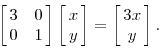

> 相当于 现在的基底 u = 3x   v=y ，（x, y）为笛卡尔坐标系单位向量

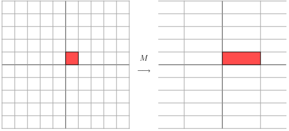

> 满秩（行满秩且列满秩）矩阵 M 

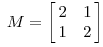

> 该基底下的 单位坐标图示

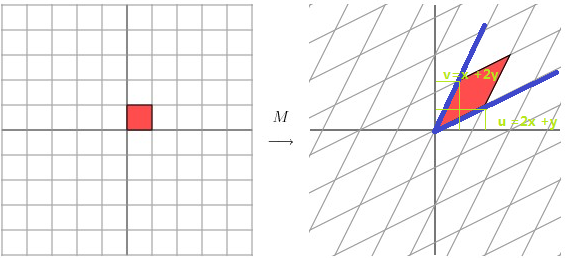

> 奇异矩阵，部分基底重合的，即，其中的某些列可以被其他列线性表示，u 和 v 重合了

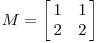

> 正交矩阵，各列之间两两垂直正交，即相乘等于0，向量相乘等于0，则向量相互垂直，
> 正交矩阵构成的基底也是相互垂直的，和笛卡尔坐标系相差一个旋转
> 使用正交矩阵进行空间变换，相当于把原来的坐标系旋转。

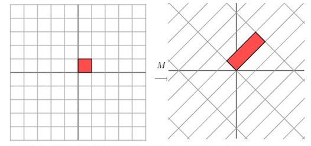

      1. 正交矩阵每一列都是单位矩阵，并且两两正交。
            最简单的正交矩阵就是单位阵 1  0  0
                                     0  1  0
                                     0  0  1
      2. 正交矩阵的逆（inverse）等于正交矩阵的转置（transpose）。 
            A 逆 = A 转置
            同时可以推论出正交矩阵的行列式的值肯定为正负1的
            A 为正交矩阵
            A 逆   =  A伴随矩阵/A的行列式  = A 转置
            正交矩阵  性质 A转置  = A逆 
            反对称矩阵性质 B转置  = -B
            对称矩阵性质　 C转置　= C


### 矩阵和矩阵相乘
> C = A * B = A * B * I = A * W ,I为单位矩阵，也就是笛卡尔坐标系, B = W 相当于从笛卡尔坐标系I 经过B变换后得到的一组空间坐标基。

> 那么C 就是基底 B 经过 A 变换后 生成的 有一个新的基底

	C = A*B, 对象B在 空间变换A 的作用下瞬间 变换到 C的位置，
	     这是一种运动，与微积分中描述的 连续的运动 不同，这是 突变， 是瞬间移动。
	     所以，矩阵乘法，展现的也是 量子力学中的 跃迁运动。
	     量子跃迁，指的是 电子 从原子的一个轨道 跳跃到 另一个轨道上的过程，这一过程是不连续的。
	     也就是不存在 电子处于两个轨道之间的状态。
	     
	I*C=A*B，I 是单位阵，标准笛卡尔坐标系。
	 声明一个C,在I坐标系下表示；声明一个B,在A坐标系下表示。
	 一个对象，在I坐标系下表示为C, 在 A坐标系下表示为B
	 
	 矩阵乘法，既可以理解为 对象 瞬间 跃迁到 另外一个坐标系；(时空隧道)
	          也可以理解为 对象没有变化，是用于表示它的坐标系 瞬间发送了变化
        
	
	 对象经过 一个坐标系 的 矩阵乘法后 可以瞬间移动 甚至 变换到高纬度的空间中，
	 以及被降维到 低纬度的空间中，就是所谓的降维打击
 
         
### 总结
      > 矩阵就是一个空间， 矩阵的每一列 都是 这个空间的一个基底，有的可能是重合的，矩阵乘法，就是在不同的基底空间中的转换表示。

      > 各个空间的维度不一定相同，如 一个 3* 2的变换矩阵 乘以一个二维空间向量 2* 1 得到一个 三维空间的向量 3 * 1 。

      > 原先 2* 2 的 变换矩阵 乘以 二维空间向量 2* 1 ，只是相当于 在一个二维平面中的变换，比如一张放在桌平面上的一张布，拉着一边拉伸变形。

      > 而 3* 2的变换矩阵 乘以一个二维空间向量 2* 1 ，从二维空间转换到了三维空间，相当于手拿着布的一点，向上提，变成了三维空间。

      > 一般而言 行列相同的变换矩阵（方阵） 对一个向量或矩阵 变换后，该矩阵或向量 的 维度不变，经过不是方阵的变换矩阵变换后维度就会发生变化

      > 矩阵的秩就是这个矩阵空间的体积，由标准空间转换过来的体积变化因子。


### 方阵 的 特征值和特征向量
#### [特征值和特征向量](http://blog.csdn.net/heyijia0327/article/details/26760737)
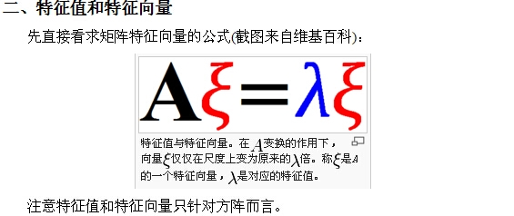

> 一般来说，一个向量 经过一个 变换矩阵 方阵 变换后，可以变成任意可能的向量，而改变换矩阵对应的 特征向量就不同了，该特征向量经过 变换矩阵 变换后，方向不变（也可能相反，在同一条直线上），仅仅是大小和之前相差一个系数,只是大小的缩放(相似变换)，该系数成称为该变换矩阵的特征值。

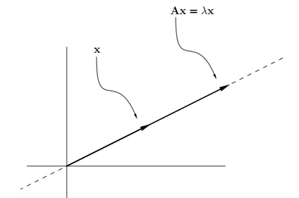

> 空间变换角度理解  A * V = a * V = a * I * A ,向量 V在空间A中的表示，与 向量V在 笛卡尔坐标系下的表示，方位不变，大小不同，也就是说，特征向量相当于一根轴线，使得轴上的点 在笛卡尔坐标系空间和 矩阵A空间的表示下 都不会离开轴，知识在轴上移动，而两个变换表示相差的尺度就是特征值。

> 类似 旋转向量的概念，笛卡尔坐标系下的坐标 进旋转轴 l,旋转一个角度c后变换到另一个空间 A矩阵，则该旋转轴l(向量)为矩阵A的特征向量

> 笛卡尔坐标I 和 矩阵B

 
> 表示的空间, 矩阵 B的特征向量为 （0.707,0.707） 和 （-0.707,0.707），为矩阵 I 和矩阵 B表示的空间的轴对称线，对称矩阵表示的是对称的空间，这里 实对称矩阵 属于不同特征值的特征向量一定正交。

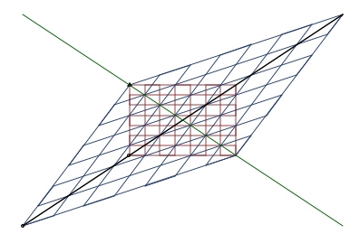

> 不同特征值的特征向量都是 线性无关的，也就是说不同特征值组成的特征向量组构成了特征向量的一组基底

> n阶方阵 A 若有 n个 线性无关的 特征向量，那么 A 可以被对角化为 A = P逆 * 上  * P , 矩阵P为特征向量矩阵


#### SVD奇异值分解
> SVD分解就是把一个 实数矩阵M 分拆成UDV = IUDV 。U，V都是正交旋转矩阵。这个分拆可以形象的理解为，我要看看这个空间M性质怎么样？

> 那我可以用标准笛卡尔空间来构造出一个一模一样的M空间。想象M空间是个特殊形状的泥塑，笛卡尔空间 I 是块标准的正方形泥块。

> 把笛卡尔空间 I 放在手里，先旋转着看看(即左乘V)，再找合适的地方捏捏它(伸缩变形)(再左乘D)，好让它和M一样。

> 最后再旋转(再左乘U)，把它摆得和M一样。这样就360度无死角的构造了一个M空间。

> 如果发现M空间有的地方很扁，那么我就掉丢这个维度，这就是SVD的降维，也是SVD的核心。

#### [奇异值分解](http://blog.csdn.net/heyijia0327/article/details/26762531)

### 线性方程组　A*x = b的求解方法
[LU分解、LDLT分解和Cholesky分解](https://blog.csdn.net/zhouliyang1990/article/details/21952485)
### LU分解  上下三角矩阵拆分　换元求解
      概念：假定我们能把矩阵A写成下列两个矩阵相乘的形式：A=LU，其中L为下三角矩阵，U为上三角矩阵。
      这样我们可以把线性方程组　Ax= b写成：
      A*x= (L*U)*x = L*(U*x) = b
      令 U*x = y，则原线性方程组 A*x = b
      可首先求解向量y 使 L*y = b，
      然后求解 Ux = y，得到 x
      从而达到求解线性方程组 A*x= b的目的。
      
> 矩阵Ａ的上三角、下三角矩阵分解

      将系数矩阵A转变成等价的两个矩阵L和U的乘积，
      其中L和U分别是下三角和上三角矩阵，而且要求L的对角元素都是1；
      由LU = A及对L和U的要求可以得到分解的计算公式。
      根据　独立特尔Doolittle分解公式　可将　矩阵A分解成　
      下三角矩阵L 和上三角矩阵U;
      
      在计算机程序中常常用到这种方法解线性代数方程组。
      它的优点是存储量很省。
      L和U中的三角零元素都不必存储，这样只用一个n阶仿真就可以把L和U存储起来。
      即：下三角存储L各元素而上三角存储U的元素。
      
      再考察公式S会发现A中任一元素aij只在计算lij（j<=i）和uij(u>=j)中用到一次，
      以后就不再出现了，因为完全可以利用原始数据A的单元，一个个逐次存储L或U中
      
> 当系数矩阵A完成了LU分解后，方程组Ax = b就可以化为L(Ux) = b，等价于求解两个方程组Ly = b和Ux = y；

> 采用LU分解有如下特点：

      （1）LU分解与右端向量无关。先分解，后回代，分解的运算次数正比于n^3，回代求解正比于n^2。
           遇到多次回代时，分解的工作不必重新做，这样节省计算时间。
      （2）分解按步进行，前边分解得到的信息为后边所用。
      （3）【A】矩阵的存储空间可利用，节省存储。
      
### LDLT分解  A =  LDU　＝　LDL转置　＝　LDLT  
      实际问题中，当求解方程组的系数矩阵是对称矩阵时，A = A转置
            正交矩阵  性质 A转置  = A逆 
            反对称矩阵性质 B转置  = -B
            对称矩阵性质　 C转置　= C
      则用下面介绍的LDLT分解法可以简化程序设计并减少计算量。
      A有唯一的Doolittle分解A= LU。
      矩阵U的对角线元素Uii 不等于0，将矩阵U的每行依次提出，得到对角矩阵Ｄ*U
      即　：
      A = LDU
      A = LDU = A转置= (LDU)转置　＝　U转置 * D转置 * L转置 = U转置 * D * L转置 = A = LDU
      应为分解的唯一性，可得：
      U转置　＝　L
      U　　＝　L转置　　＝　LT这里的T表示转置的意思
      则：
      A =  LDU　＝　LDL转置　＝　LDLT  , 这里LT为L的转置矩阵
      
      记录　ｕ　＝　LD
            v  ＝  L转置
      将A分解为上面两个矩阵　相乘　A = u * v
      Ax = b就可以化为u(v*x) = uy = b
      先求解　y
      得到　y = v*x
      再求解　x
      
      

### Cholesky分解
      先修只知识：
      矩阵的共轭转置矩阵：
           实数矩阵的共轭转置矩阵就是转置矩阵，
            复数矩阵的共轭转置矩阵，就是先转置，后在对元素取共轭，
            共轭，a+bi的数变成a-bi，实部不变，虚部变为相反数

      A = LL*。其中L是下三角矩阵。L*是L的共轭转置矩阵
      A 满足　矩阵中的元素共轭对称＋正定
      L是唯一确定的，而且L的对角元素肯定是正数。反过来也对，即存在L把A分解的话，A满足以上两个条件。
      如果A是半正定的（semi-definite），也可以分解，不过这时候L就不唯一了。
      特别的，如果A是实数对称矩阵，那么L的元素肯定也是实数。

      另外，满足以上两个条件意味着A矩阵的特征值都为正实数，因为Ax = lamda * x,
      (x*)Ax = lamda * (x*)x > 0, lamda > 0
      

## 逆矩阵 伪逆矩阵  矩阵转置
[现代视频](http://www.bilibili.com/video/av6731067/index_5.html#page=1)
> 转置  列与行互换    

     1. (A * B)转置 = B转置 * A转置 ，
      
	      A*B:
		  | 2   4
		  | 3   5
	      ____|___B_______
	      1  2| 8   14 ------>转置     8    18
	      3  4| 18  32                14    32
		A |

	      B'*A'
		  | 1   3
		  | 2   4
	      ____|__A'_______
	      2  3| 8   18
	      4  5| 14  32
	       B' |      

      
      2. (A + B)转置 = A转置 +  B转置， 
      3. (K * A)转置=K* A转置， 
      4. A转置 * B = (B转置 * A)转置
> 共轭转置矩阵

      矩阵有实数矩阵和复数矩阵。
      转置矩阵仅仅是将矩阵的行与列对换，
      而共轭转置矩阵在将行与列对换后还要讲每个元素共轭一下。
      共轭你应该知道，就是将形如 a+bi 的数变成a-bi，实数的共轭是它本身。
      所以，
      实数矩阵的共轭转置矩阵就是转置矩阵，
      复数矩阵的共轭转置矩阵就是上面所说的行列互换后每个元素取共轭。

> 逆矩阵，非奇异方矩阵，有逆矩阵，A的伴随矩阵 除以 A的行列式，

      AB=BA=E, B成为A的逆,
      A逆的逆=A ，
      A逆的转置 = A转置的逆，
      (AB)逆 = B逆* A逆
> 求解逆矩阵可使用 cholesky分解，则A = R转置 * R   R是上三角阵 R转置是下三角矩

> A-¹=（R转置 * R）-¹ = R-¹ （R转置）-¹ =R-¹ *（R-¹）转置 

> 伪逆矩阵，是逆矩阵的广义形式，由于 奇异矩阵(行列式值为0) 或 非方阵的矩阵 不存在逆矩阵，但是有伪逆矩阵

> 一个与A的 转置矩阵A' 同型的矩阵X，并且满足:AXA=A, XAX=X, (AX)转置=AX  (XA)转置 = XA 此时，称矩阵X为矩阵A的伪逆，也称为广义逆矩阵。

## 协方差矩阵的传播
> 如果, X 的协方差为 C

> 变量组X的线性变换， f(X) = AX，则f(X)的协方差为 A * C * A转置  = (A转置 * C逆 * A)逆 = (A转置 * C逆 * A)伪逆

> 变量组X的非线性变换 F(X)，一阶偏导数矩阵(雅克比矩阵，偏导数在均值处的值)为J，则F(X)的协方差为 J * C * J转置 = (J转置 * C逆 * J)逆 = (J转置 * C逆 * J)伪逆

## 矩阵向量的求导数
[矩阵 向量求导法则 pdf](http://files.cnblogs.com/files/leoleo/matrix_rules.pdf)

[矩阵 向量求导法则 知乎](https://zhuanlan.zhihu.com/p/28791380)

[矩阵求导术（上） 知乎](https://zhuanlan.zhihu.com/p/24709748)


##  概率（probabilty）和统计（statistics）看似两个相近的概念，其实研究的问题刚好相反。
###  A. 概率研究的问题是，已知一个模型和参数，怎么去预测这个模型产生的结果的特性（例如均值，方差，协方差等等）。
[参考](https://blog.csdn.net/u011508640/article/details/72815981)

      举个例子，
      1. 我想研究怎么养猪（模型是猪），
      2. 我选好了想养的品种、喂养方式、猪棚的设计等等（选择参数），
      3. 我想知道我养出来的猪大概能有多肥，肉质怎么样（预测结果）。
      
### B. 统计研究的问题则相反。统计是，有一堆数据，要利用这堆数据去预测模型和参数。
      仍以猪为例。
      1. 现在我买到了一堆肉，
      2. 通过观察和判断，我确定这是猪肉
      （这就确定了模型。在实际研究中，也是通过观察数据推测模型 是 高斯分布? 指数分布? 拉普拉斯分布? ），
      3. 然后，可以进一步研究，判定这猪的品种、这是圈养猪还是跑山猪还是网易猪，等等（推测模型参数）。
      
###  C. 一句话总结：
      概率是已知模型和参数，推数据。
      统计是已知数据，推模型和参数。
      
### 贝叶斯公式到底在说什么
      1. 条件概率： 
                  P(A/B) = P(AB)/P(B)  B事件发生的条件下， A事件发生的概率

      2. 乘法公式： 
                  可以由条件概率得到 P(AB) = P(A/B) * P(B) = P(AB)/P(A) * P(A) = P(B/A) * P(A)
                  AB事件都发生的概率 = B发生下A也发生 = A发生下B也发生
      3. 全概率公式： 
                  S为全集，B1,...Bn为S集合的一个全划分
                  P(A) = P(AS)=P(A(B1+B2+...+BN)) = P(AB1)+...+P(ABn)
                       = P(A/B1)P(B1) + ... + P(A/Bn)P(Bn)
                       = sum(P(A/Bi) * P(Bi))
      4.贝叶斯公式：
                 P(Bi/A) = P(ABi)/P(A)                          条件概率 + 
                         = P(A/Bi)P(Bi)/P(A)                    乘法公式 +
                         = P(A/Bi)P(Bi)/(sum(P(A/Bi) * P(Bi)))  全概率公式

      意思就是说 有多种情况可以导致 观测事件A发生，需要求当观测到 事件A发生了，由事件B1引发的概率（P(B1/A)）
      但是直接求不容易求解，可以转化成 在原因事件Bi发生下，结果事件A发生的概率来联合求解。

      例如，观测到 汽车报警响了A，可能由 行人误碰 引起B1，也可能真是由于小偷偷车引起B2

      一般情况下：
      行人误碰 B1 事件发生的概率为 0.7
      小偷偷车 B2 事件发生的概率为 0.3

      而 行人误碰事件B1发生下 汽车发出声响的概率为 0.6  不发出声响的概率为 0.4
      而 小偷偷车事件B2发生下 汽车发出声响的概率为 0.4  不发出声响的概率为 0.6

      当 观测到 汽车报警响了 事件A发生，求是由于小偷偷车引起的概率

      P(B2/A) = P(AB2)/P(A) 
              = P(A/B2) * P(B2)/( P(A/B1)* P(B1) + P(A/B2)* P(B2) )
              = 0.4 * 0.3 / (0.7 * 0.6 + 0.3 * 0.4 )
              = 0.2222222
### 似然函数（likelihood function）  似然（likelihood）这个词其实和概率（probability）是差不多的意思

      1. P(X | O) 表示一个概率， X是一个数据， O是模型参数；
      2. 模型参数O已知， 数据X是变量，已知模型参数，求不同数据样本点出现的概率，是概率函数，是用来确定发生概率最大的数据；
      3. 数据X已知， 模型参数O是变量，已知数据X出现，求这个数据符合不同模型参数的概率，是似然函数，是用来估计模型参数的。

###  最大似然估计（Maximum likelihood estimation, 简称MLE）
      已知数据，模型参数为变量，求使得函数值最大的，模型参数。
      例如：
      1. 有一枚硬币，我们想确定这枚硬币（模型对象）是否是均匀的（抛出来正反面概率一致，模型参数）
      2. 我们需要获取数据，于是我们那这枚硬币抛了10次，得到数据X0是：反正正正正反正正正反。
      3. 假设出现正面的概率为O，是模型参数，且反面概率为 1-O （假设为二项分布，不会出现站立的情况）
      4. 那么出现这个数据的概率输是 f(x0,O) = (1-O)OOOO(1-O)OOO(1-O) = O^7 * (1-O)^3
      5. 该似然函数 f(x0,O)，是一个关于O的函数f(O)，最大似然的意思就是要最大化这个函数
      6. 可以画出f(O)的图象，可以得到 在 O = 0.7的时候，似然函数取得最大值
      
      结论：
      做10次实验，有7次正面向上，最大使然认为正面向上的概率是 0.7. 有点不太合理...? 贝叶斯学派就提出了异议
### 最大后验概率估计（Maximum a posteriori estimation, 简称MAP）
      考虑先验概率分布。 为此，引入了最大后验概率估计。

      1. 最大似然估计     是求参数O，  使得 似然函数概率 P(X | O)最大
      2. 最大后验概率估计  是求参数O，  使得 函数概率 P(X | O) * P(O)最大   也就是 P(O|X0) 后验概率最大 
      思想：
         求得的O，不单单让似然函数最大，O自己出现的概率也要比较大才可以；
         有点像正则化里的 加参数惩罚项的思想（让在参数较小的情况下，参数组成的损失函数也比较小）
         不过正则化里是利用  加法 (因为是最小化，两者都比较小，其和才比较小)
         而 最大后验概率估计 MAP 是利用 乘法(两个都比较大，乘积才比较大)
      其实有点 与门的思想， 要使得 两个量运算之后在两者都较小的情况下取得最小值，使用加法，
          两个都较小相加之后还是比较小，如果一个大一个小，相乘之后，积还是比较小，所以要使得三者都比较小，使用 加法 运算
      要使得三者都比较大，使用乘法运算，
          两个都比较大，相乘之后还是比较大，一个较大一个较小，相乘之后就比较小；而一个较大一个较小，相加之后比较大。

      MAP其实是在 最大化 P(O|X0) = P(X0|O)*P(O)/P(X0) 
      因为 X0 是确定的 在总实验次数下 出现X0数据的概率是可以有实验数据确定性得到的，所以就不考虑分母了

      P(O|X0) 就是数据X0已经出现了，要就O去什么值使得 P(O|X0) 后验概率 最大
      
### 模型参数 的先验知识
      由先验知识（常识）知道 模型参数O 取的 0.5 的概率最大，所以我们可以假设，P(O)符合均值为0.5 方差为 0.1的高斯分布
      也就是 在 0.5 出概率最大，两边逐渐减小
      
      P(O) =  1/(sqrt(2*pi)*方差) * exp(-(O - 均值)^2/(2*方差^2))
           =  1/(sqrt(2*pi)*0.1) * exp(-(O - 0.5)^2/(2*0.1^2))
           
       P(X0 | O) * P(O) 的图像 开口向下 峰值横坐标 由0.7 向 0.5 偏移
       得到在 O = 0.558的情况下 后验概率  P(O|X0) 最大
#### 总结
       1. 最大后验概率估计MAP 比最大似然估计MLE 对了一个作为乘法因子的 先验概率 P(O)
       2. 或者也可以认为，MLE 相对于 MAP 是把 先验概率 P(O) = 1，即认为 模型参数O 是均匀分布
         

### 高斯分布
#### 一维高斯分布
[参考](http://www.tina-vision.net/docs/memos/2003-003.pdf)


> 均值u, 标准差 西格玛，方差 西格玛平方


> 均值u 决定了 曲线在 坐标轴上的位置, 方差 决定了曲线的形状，方差越大，数据间差异越大，分布越广泛，曲线矮胖，反之，数据集中分布，曲线瘦高。

#### 两个一维高斯分布的乘积

> 红色为乘积后的分布，均值在两个高斯分布均值之间，标准差，比两个都小(高瘦)


	两个高斯分布的乘积任然为高斯分布，所以 合成后的均值u 为合成分布函数最高点处的x值；

	所以对合成分布函数求 一阶导数，，令f'(x)=0 得到：  
	(x-u1)/c1^2 + (x-u2)/c2^2 = 0,  得到：  
	x = (u1 * c2^2 + u2 * c1^2)/(c1^2 + c2^2)

	所以合成分布的 均值 u = (u1 * c2^2 + u2 * c1^2)/(c1^2 + c2^2)   u为均值，c为方差。

	合成方差 1/c^2 = 1/c1^2 + 1/c2^2 


#### 多维高斯分布


> 均值u 为n * 1的向量，n为维度数, 一维的方差 变成了多维度向量之间的协方差矩阵, 协方差求逆，代替了 一维 除以方差， 多维时 x-u为矩阵形式(其实为向量)，一维时直接平方即可，多维时，需要 矩阵转置 * 矩阵。


> 对应的协方差矩阵如下：


> 协方差矩阵的主对角线，是各个变量本身的 方差，其余反应个变量之间的相关关系, 就上面的二元高斯分布而言，协方差越大，图像越扁，也就是说两个维度之间越有联系。


## 微积分
    泰勒公式展开
    
    f(x) = sum( f(n')(x0) / n! * (x-x0)^2 )
    每一项的作用，要被 n! 削弱，所以n越大，被削弱的就越厉害。
    
    f(x) = f(x0) + f′(x)Δx
    结果  = 现状  + 变化方向(原因) * 时间
    导数(原因) 把 结果和现状 联系在了一起。
    导数是函数的原因，函数是导数的结果。
    
    导数 的 导 ，导致、引导、导向、因势利导，到的本质就是原因、方向。
    
    成功，不取决于你所站的位置，而要看你要去的方向。
    Success, it is not the position where you are standing, but which direction you are going.
    
    数学即哲学，世界中的万事万物都是存在因果关系的，
    因果关系即为导数与原函数的关系。
    
    可以使用 导数 对未来 进行预测
    
    F'(x) = f(x)
    f(x) 是 F(x) 的 导函数
    F(x) 是 f(x) 的 原函数
    F(x) + 常数C 的导数也是 f(x)
    所以 f(x) 有一族原函数 F(x) + 常数C
    
    所以 导函数更为 本质，因为站的更高，看的更远，才能发现本质，看清现实。
    所以 导函数 比原函数 高一个维度，原函数 比 导函数 少一个维度。
    
    举个例子，一个灯下的三维物体，从不同的角度投影到二维平面上，可以有不同的椭圆、圆等形状。
    即，三维物体 有 无穷多个 二维的投影。
    正如 导数 有无穷多个 原函数。
    低维的 函数 是 高维的导函数 的 投影。
    所以 三维空间中的 人，可能是 4/5/...维空间中的 高级文明生物的 投影?^_^ 可怕
    
    因为有了高维 空间 的具体的 原因(对象)
    才有了 低维空间 不同的 结果。
    
    比如高维的速度，决定了 低维 的 位移。
    高维的 加速度 决定了 低维的 速度。
    应该高维 更加本质，所以 在低维看来很复杂的问题，在高维中是如此的简单。
    
    又如，在空间图 画在 二维空面上 需要 正视图、左视图、上视图等，在三维软件中，只需要一个三维模型就够了。
    
    由复杂  统一整合 出 形式简洁美妙的新理论，这就是 升维思维 的奇妙。
    
## 数值优化
[牛顿法 高斯牛顿法 莱文贝格－马夸特方法](http://blog.csdn.net/liu14lang/article/details/53991897)
### 牛顿法
> 一般来说我们利用牛顿法使用来求f(x)=0的解。 先对f(x)一阶泰勒展开得 

> f(x+Δ)=f(x)+f′(x)Δ=0，  f'(x)为斜率 tan(a) 对边长度 = 斜率×直角边 = f'(x)×Δ

                   |
                   |
            |——————
            f(x0)  f(x0+Δ)
 
> 所以我们有   Δ = x−x0 = −f(x0) / f′(x0), 即 x = x0 − f(x0) / f′(x0) 不断迭代优化

> 因此也就得到了我们的牛顿迭代公式：  xn = xn−1 − f(xn−1) / f′(xn−1)

#### 算法应用 求一个数的立方根  平方根 ...
```c
// 求一个数的立方根
#define E 0.0001 //精度设置
using namespace std;
double getCubeRoot(double num)
{
	double x0=num;// 初始解
	double result;// 最终结果
	while (1)
	{
		result = x0-(x0*x0*x0-num)/(3*x0*x0); 
		// 给定num，需要计算一个x，使得 f(x) = x^3-num 最小化
		// 对函数求导 f'(x)=3*x^2 ，进行更新迭代 x=x-f(x)/f'(x)
		// 牛顿迭代 f(x) = x^3-num, f'(x)=3*x^2; x=x-f(x)/f'(x);
		if ((result*result*result-num) < E && (result*result*result-num) > -E )
			return result;
		else
			x0=result;
	}
}

```

####  牛顿下山法  逐次 减小 变化调整
      有 Δ = x−x0 = −f(x0) / f′(x0), 即 x = x0 − f(x0) / f′(x0) 不断迭代优化
      为了保证每次 变化的量逐渐变小  加入逐渐变小的变化率 W (W=1 后逐次减半)
      即 x = x0 −  W * f(x0) / f′(x0) 不断迭代优化   (W=1 后逐次减半)
      为减弱牛顿法对初始近似
      
#### 动量法加入之前的一次变化
#### momentum 想象一个铁球下山 速度回越来越快 重力势能转换成 速度动能   考虑上次的速度
      Δt  = Q * Δt-1  + W * (f(x0) / f′(x0)) 更新速度 会越来越快  有可能到了山底停不下来(冲过了)
      Δt  = Q * Δt-1  + W * (f(x0)) * J(x0) 当前点算梯度
      xt  =  xt-1 - Δt  
#### 动量法的改进
      Δt  = Q * Δt-1  + W * (-f(x0)) * J(x0 - Q * Δt-1)  向前走一步后(x0 - Q * Δt-1) 再算梯度


#### 自动参数调整  之前调整量小的 下一次更新越多  之前更新量大的 下一次更新越少  平方和
      每个参数的梯度 g
      梯度历史矩阵   G = SUM(g^2)  记录每个参数 之前更新的量  平方和
      更新参数      xt  =  xt-1 - W * (1/G) * g
      存在的问题    更新衰减太快
      
#### 使用移动平均的梯度平方 来决定更新参数的更新量
      每个参数的梯度 g
      移动平方均值   Et(g^2) = t * Et-1(g^2) + ( 1 - t) * g^2
      更新参数      xt  =  xt-1 - W * (1/E) * g
      存在的问题    单位不匹配

#### 既考虑前一次更新量（动量 方向信息） 也考虑了之前所有更新量的平方和 作为衰减信息
      梯度  gt
      动量  mt = r * mt-1  + (1-r) * gt     梯度自身求和 相当于 一阶矩 
      衰减  vt = t * vt-1  + (1-t) ) gt^2   梯度平方求和 相当于 二阶矩
           // 这里的求和方法 类似传感器滤波的 数值滤波方法  
           // float tep=0.0; tep = (tep + 5 * sensor_dat)/6.0; 这里的权重分别为 1/6  和 5/6  和为1
      更新  xt  =  xt-1  - W * (1/vt) * mt

#### 神经网络 反向传播
[台大视频参考](http://speech.ee.ntu.edu.tw/~tlkagk/courses/MLDS_2015_2/Lecture/DNN%20backprop.ecm.mp4/index.html)


      
### 求解最优化问题
> min　f(x)  牛顿法首先则是将问题转化为求 f′(x)=0

> 这个方程的根, 一阶展开：  f′(x) ≈ f′(x0) + (x－x0)f′′(x0)

> 令  f′(x0) + (x－x0)f′′(x0) = 0

> x = x0 − f'(x0) / f′'(x0) 不断迭代优化

## 高斯牛顿法
> 在讲牛顿法的时候，我们举的例子x是一维的，若如果我们遇到多维的x该如何办呢？这时我们就可以利用雅克比，海赛矩阵之类的来表示高维求导函数了。

> 例如 求 f(X)=0, 其中X=[x0,x1,...,xn]

[Jacobian矩阵和Hessian矩阵](http://jacoxu.com/jacobian%E7%9F%A9%E9%98%B5%E5%92%8Chessian%E7%9F%A9%E9%98%B5/)

> 所以我们有雅克比矩阵： 


> 有海赛矩阵


> 所以高维牛顿法解最优化问题又可写成： Xn+1 = Xn −  Hf(xn)逆 * ∇ * f(xn)

> 梯度(J) 代替了低维情况中的一阶导   Hessian矩阵代替了二阶导    求逆代替了除法 

> 有海赛矩阵的雅克比近似  H ≈ J转置 * J

> 高斯牛顿 迭代公式  Xn+1 = Xn −(J转置 * J)逆 * J转置 * f(xn)

## Levenberg-Marquardt算法 莱文贝格－马夸特方法
> 莱文贝格－马夸特方法（Levenberg–Marquardt algorithm）能提供数非线性最小化（局部最小）的数值解。此算法能借由执行时修改参数达到结合高斯-牛顿算法以及梯度下降法的优点，并对两者之不足作改善（比如高斯-牛顿算法之反矩阵不存在或是初始值离局部极小值太远）

> 在高斯牛顿迭代法中，我们已经知道 Δ = − (J转置 * J)逆 * J转置 * f(xn)

> 在莱文贝格－马夸特方法算法中则是 Δ = −(J转置 * J  + λI )逆 * J转置 * f(xn)

> Levenberg-Marquardt方法的好处就是在于可以调节

> 如果下降太快，使用较小的λ，使之更接近高斯牛顿法

> 如果下降太慢，使用较大的λ，使之更接近梯度下降法


# 最小二乘图优化   
## 闭环检测
> 假设一个机器人初始起点在0处x0，然后机器人向前移动，通过编码器测得它向前移动了1m，到达第二个地点x1。

> 接着，又向后返回到x2，编码器测得它向后移动了0.8米。

> 但是，通过闭环检测，发现它回到了原始起点。

> 可以看出，编码器误差导致计算的位姿和观测到有差异，那机器人这几个状态中的位姿到底是怎么样的才最好的满足这些条件呢
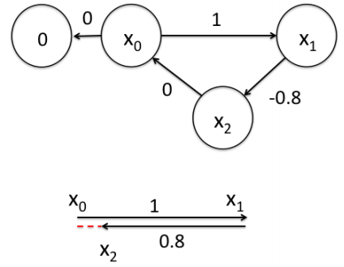

> 首先构建位姿之间的关系，即图的边
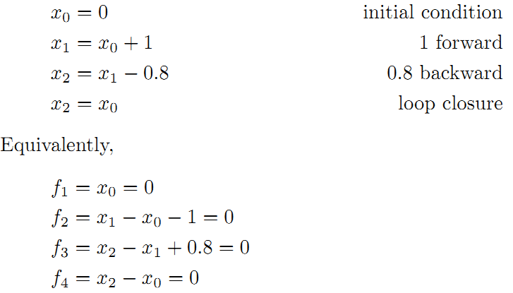

> 线性方程组中变量小于方程的个数（三个未知数，四个方程），要计算出最优的结果，使出杀手锏最小二乘法。先构建残差平方和函数：
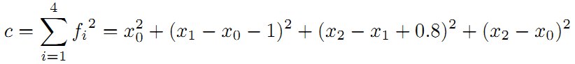

> 为了使残差平方和最小，我们对上面的函数每个变量求偏导，并使得偏导数等于0.
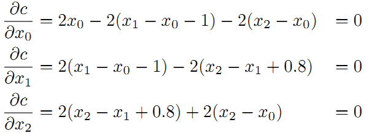

> 整理得到
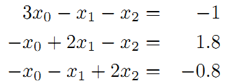

> 接着矩阵求解线性方程组
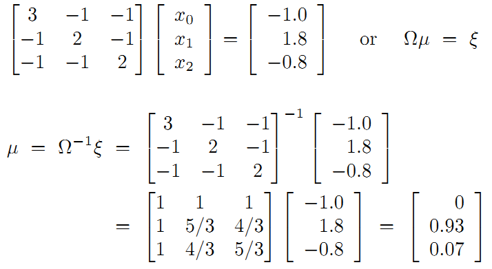

> 所以调整以后为满足这些边的条件，机器人的位姿为：
X0 = 0, X1 = 0.93, X2 = 0.07.

> 在这里例子中我们发现，闭环检测起了决定性的作用。

## 观测的路标（landmark）
> 上面是用闭环检测，这次用观测的路标（landmark）来构建边。如下图所示，假设一个机器人初始起点在0处，并观测到其正前方2m处有一个路标。然后机器人向前移动，通过编码器测得它向前移动了1m，这时观测到路标在其前方0.8m。请问，机器人位姿和路标位姿的最优状态
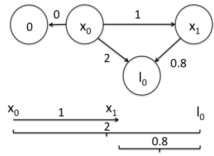

> 在这个图中，我们把路标也当作了一个顶点。构建边的关系如下


> 左边-右边 得到误差方程
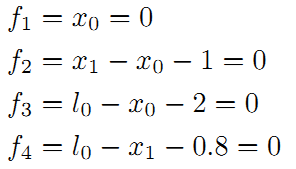

> 残差平方和
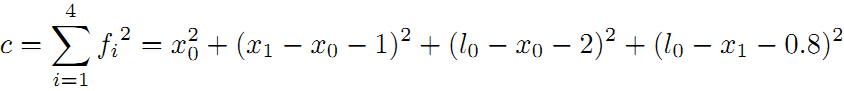

> 求偏导数
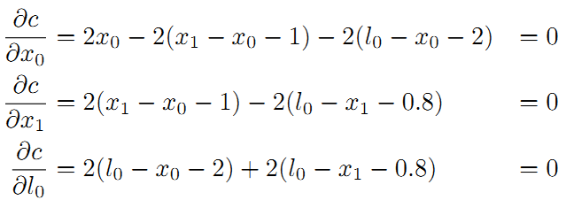

> 最后整理并计算得
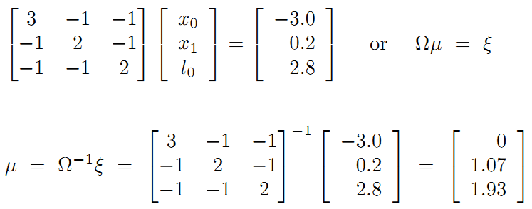

> 得到路标和机器人位姿 
X0 = 0, X1 = 1.07, l2 = 1.93

## 边的信息矩阵 边的 权重
> 将引入了一个重要的概念。我们知道传感器的精度是有差别的，也就是说我们对传感器的相信程度应该不同。比如假设这里编码器信息很精确，测得的路标距离不准，我们应该赋予编码器信息更高的权重，假设是10。

> 重新得到残差平方和如下

> c = sum(fi) = x0^2 + 10 * (x1 - x0 - 1)^2 + (l0 - x0 -2)^2 + (l0 - x1 - 0.8)^2

> 求偏导得到
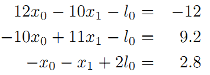

> 转换为矩阵求逆矩阵得到解
X0 = 0, X1 = 1.01, l2 = 1.9

> 将这个结果和之前对比，可以看到这里的机器人位姿x1更靠近编码器测量的结果。请记住这种思想，这里的权重就是在后面将要经常提到的边的信息矩阵。

# 图优化理论分析
[图优化理论分析1](http://blog.csdn.net/heyijia0327/article/details/47731631)
[图优化理论分析2](http://www.cnblogs.com/gaoxiang12/p/5244828.html)
 > 由以上 实例分析可得：
 
 > 目标函数
 
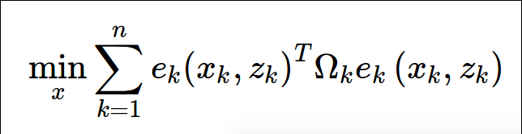
   > e 函数在原理上表示一个误差，是一个矢量，作为优化变量Xk和 实际值Zk符合程度的一个度量。
   
   > 它越大表示xk越不符合zk。但是，由于目标函数必须是标量，所以必须用它的平方形式来表达目标函数。
   
   > 最简单的形式是直接做成平方：e(x,z)转置 * e(x,z)。  

> 进一步，为了表示我们对误差各分量重视程度的不一样，还使用一个信息矩阵 Ω 来表示各分量的不一致性。

> 信息矩阵 Ω 是协方差矩阵(ei 与 ej的相关性)的逆(即相关性越高，该误差项权重越小，或是 与该误差项(边)的变量的准确度相关)，是一个对称矩阵。由于图优化里每一条边代表一个测量值，如表示相邻位姿关系的编码器测量值 或者 图像（激光）匹配得到的位姿变换矩阵。所以图优化里每一条边的信息矩阵就是这些测量协防差矩阵的逆。如果协防差越小，表示这次测量越准越值得相信，信息权重就越大。

> 它的每个元素Ωi,j作为ei, ej的系数，可以看成我们对ei,ej这个误差项相关性的一个预计。

> 最简单的是把Ω设成对角矩阵（各误差间独立），对角阵元素的大小表明我们对此项误差的重视程度。

> 这里的Xk可以指一个顶点、两个顶点或多个顶点，取决于边的实际类型。

> 所以，更严谨的方式是把它写成ek(Zk,Xk1,Xk2,…)，但是那样写法实在是太繁琐，我们就简单地写成现在的样子。

> 由于Zk是已知的，为了数学上的简洁，我们再把它写成ek(Xk)的形式。

> 于是总体优化问题变为n条边加和的形式：


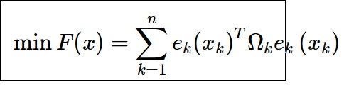

> 边的具体形式有很多种，可以是一元边、二元边或多元边，它们的数学表达形式取决于传感器或你想要描述的东西。

> 例如视觉SLAM中，在一个相机Pose Tk 处对空间点xk进行了一次观测，得到zk，那么这条二元边的数学形式即为:

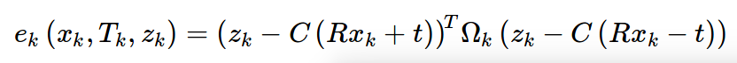

> 单个边其实并不复杂。

> 可以使用 高斯牛顿法进行迭代优化，需要知道 两样东西：一个初始点和一个迭代方向。为了数学上的方便，先考虑第k条边ek(Xk)吧。

> 我们假设它的初始点为x˜k，并且给它一个Δx的增量，那么边的估计值就变为Fk(x˜k + Δx)，而误差值则从 ek(x˜k) 变为 ek(x˜k + Δx)。

> 首先对误差项进行一阶展开：

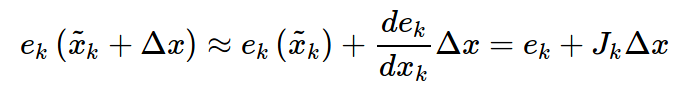

> 这是的Jk是ek关于Xk的导数，矩阵形式下为雅可比阵。

> 我们在估计点附近作了一次线性假设，认为函数值是能够用一阶导数来逼近的，当然这在Δx很大时候就不成立了。

> 于是，对于第条边的目标函数项，进一步展开：

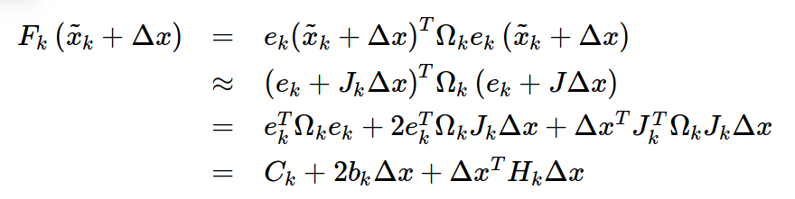

> 其中，矩阵转置性质  (A * B)转置 = B转置 * A转置；(A + B)转置 = A转置 + B转置；(K * A)转置=K* A转置；A转置 * B = (B转置 * A)转置

> 在熟练的同学看来，这个推导就像(a+b)^2=a^2 + 2ab + b^2一样简单。

> 最后一个式子是个定义整理式，我们把和Δx无关的整理成常数项 Ck，把一次项系数写成 2 * bk ，二次项则为 Hk（注意到二次项系数其实是Hessian矩阵），bk = ek转置 * Ω * J ,  Hk =  J转置* Ω * J  。

> 请注意 Ck 实际就是该边变化前的取值。所以在xk发生增量后，目标函数Fk项改变的值即为:

> ΔFk = 2 * bk * Δx + Δx转置 * Hk * Δx

> 我们的目标是找到Δx，使得这个增量变为极小值（Fk最小 不发生变化）。所以直接令它对于Δx的导数为零，有：

> dFk / dΔx = 2 * b + 2 * Hk * Δx = 0  得到 Hk * Δx  = −bk

> 所以归根结底，我们求解一个线性方程组：Hk * Δx = −bk，   Δx = - Hk逆 * bk = -(J转置* Ω * J)逆 * ek转置 * Ω * J 高斯牛顿迭代

> 莱文贝格－马夸特迭代Δx = -(Hk + a * I) 逆 * bk = -(J转置* Ω * J + a * I )逆 * ek转置 * Ω * J , 引入一个松弛因子来控制迭代速度

> x* = x' +  Δx，这里的加法不是简单的加法，是一个增量来更新 X ,这里需要指定更新方式。

> 如果把所有边放到一起考虑进去，那就可以去掉下标，直接说我们要求解  : H * Δx = −b.   b里面含有一个雅克比矩阵，  Δx的系数为海塞矩阵

> 一阶导雅克比矩阵 和二阶导海塞矩阵 均为稀疏的矩阵，即大部分是零元素。 Jk = (0 ··· 0 Jk1 ··· Jki ··· 0 ··· Jkq0 ··· 0)

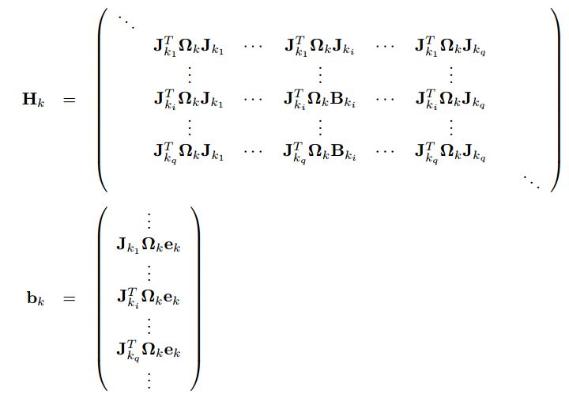

> 这种稀疏性能很好地帮助我们快速求解上面的线性方程。稀疏代数库包括SBA、PCG、CSparse、Cholmod等等。g2o正是使用它们来求解图优化问题的。

> 在数值计算中，我们可以给出雅可比和海塞的解析形式进行计算，也可以让计算机去数值计算这两个阵，而我们只需要给出误差的定义方式即可。

## 流形  刚柔并济  实在是太有智慧了
[浅谈流形学习](http://blog.pluskid.org/?p=533)

      流形（Manifold），一般可以认为是局部具有欧氏空间性质的空间。
      而实际上欧氏空间就是流形最简单的实例。像地球表面这样的球面是一个稍为复杂的例子。
      一般的流形可以通过把许多平直的片折弯并粘连而成。

      流形在数学中用于描述几何形体，它们提供了研究可微性的最自然的舞台。
      物理上，经典力学的相空间和构造广义相对论的时空模型的四维伪黎曼流形都是流形的实例。
      他们也用于组态空间(configuration space)。环(torus)就是双摆的组态空间。

      我们可以把光滑流形看作是介于两者之间的形体，其无穷小的结构是硬的，而整体结构是软的。
      这也许是中文译名流形的原因(整体的形态可以流动)

> 给目标函数F(x)一个增量Δx时，直接就写成了F(x+Δx)。但是这个加法可能没有定义！

> 最简单的就是常见的四维变换矩阵T或者三维旋转矩阵R。

> 它们对加法并不封闭，因为两个变换阵之和并不是变换阵，两个正交阵之和也不是正交阵。

> 它们乘法的性质非常好，但是确实没有加法，所以也不能像上面讨论的那样去求导。

> 虽然李群 SE(3) 和 SO(3) 是没有加法的，但是它们对应的李代数 se(3),so(3) 有啊！ 

> 我们可以求它们在正切空间里的流形上的梯度！ 我们就说，通过指数变换先把变换矩阵和旋转矩阵转换成李代数，在李代数上进行加法，

> 然后通过对数变换再转换到原本的李群中。这样我们就完成了求导。


      有时候经常会在 paper 里看到“嵌入在高维空间中的低维流形”，
      不过高维的数据对于我们这些可怜的低维生物来说总是很难以想像，
      所以最直观的例子通常都会是嵌入在三维空间中的二维或者一维流行。
      比如说一块布，可以把它看成一个二维平面，这是一个二维的欧氏空间，
      现在我们（在三维）中把它扭一扭，它就变成了一个流形（当然，不扭的时候，
      它也是一个流形，欧氏空间是流形的一种特殊情况, 而黎曼空间(弯曲的坐标轴生成的空间)是其一般情况）。

      一个流形好比是一个 d 维的空间，在一个 m 维的空间中 (m > d) 被扭曲之后的结果。
      需要注意的是，流形并不是一个“形状”，而是一个(被扭曲的)“空间”，
      如果你觉得“扭曲的空间”难以想象，那么请再回忆之前一块布的例子。

      广义相对论似乎就是把我们的时空当作一个四维流（空间三维加上时间一维）形来研究的，
      引力就是这个流形扭曲的结果。

      把流形引入到机器学习领域来主要有两种用途：
            一是将原来在欧氏空间中适用的算法加以改造，使得它工作在流形上，
                 直接或间接地对流形的结构和性质加以利用；
            二是直接分析流形的结构，并试图将其映射到一个欧氏空间中，
                 再在得到的结果上运用以前适用于欧氏空间的算法来进行学习。

      Multidimensional Scaling (MDS 多维尺度变换) ，MDS 是一种降维方法，
      它的目的就是使得降维之后的点两两之间的距离尽量不变（也就是和在原是空间中对应的两个点之间的距离要差不多）。
      只是 MDS 是针对欧氏空间设计的，对于距离的计算也是使用欧氏距离来完成的。
      如果数据分布在一个流形上的话，欧氏距离就不适用了。

      我们国内的很多人知道PCA，却很多人不知道MDS。
      PCA和MDS是相互对偶的两个方法。
      MDS就是理论上保持欧式距离的一个经典方法，
      MDS最早主要用于做数据的可视化。
      由于MDS得到的低维表示中心在原点，所以又可以说保持内积。
      也就是说，用低维空间中的内积近似高维空间中的距离。
      经典的MDS方法，高维空间中的距离一般用欧式距离。

      Isomap就是借窝生蛋。他的理论框架就是MDS，但是放在流形的理论框架内，
      原始的距离换成了流形上的测地线（geodesic)(曲面上两点之间最短的曲线) 距离。
      其它一模一样。所谓的测地线，就是流形上加速度为零的曲线，等同于欧式空间中的直线。
      我们经常听到说测地线是流形上两点之间距离最短的线。

      让我们再回到地球——这个在三维空间中的二维流形，
      假设我们要在三维空间中计算北极点和南极点的距离，这很容易，就是两点相连的线段的长度，
      可是，如果要在这个流形上算距离就不能这样子算了，我们总不能从北极打个洞钻到南极去吧？
      要沿着地球表面走才行，当然，如果我随便沿着什么路线走一遍，然后数出总共走了多少步作为距离，
      这是不成的，因为这样一来如果我沿着不同的路线走，岂不是会得到不同的距离值？

      总而言之，我们现在需要一个新的定义在地球表面（流形）上的距离度量，理论上来说，
      任意满足测度的 4 个条件的函数都可以被定义为距离，不过，为了和欧氏空间对应起来，这里选择一个直线距离的推广定义。

      还记得初中学的“两点之间，线段最短”吗？现在，我们反过来说，把线段的概念推广一下，
      变成“两点之间最短的曲线是线段”，
      于是流形上的距离定义也就等同于欧氏空间了：
      流形上两个点之间的距离就是连接两个点的“线段”的长度。
      虽然只是置换了一个概念，但是现在两者统一起来了，不过，
      在流形上的线段大概就不一定是“直”的了（于是直线也变成不一定是“直”的了），
      
      通常又称作是“测地线”。
      弯曲的直线(测地线)。

      局部线性嵌入（LLE） (Locally linear Embedding)
      等距映射（Isomap）
      拉普拉斯特征映射（Laplacian Eigenmap
      多维尺度变换（MDS） Multidimensional Scaling
      
## 多视角几何 

[跟我一起学Multiple View Geometry多视图几博客](https://blog.csdn.net/fk1174/article/details/51811644)

[读书笔记](https://blog.csdn.net/serenitymk/article/category/7574945)

[多视图几何 TUM 课](https://blog.csdn.net/u011306452)

[德国慕尼黑工业大学(TUM)计算机视觉组](https://vision.in.tum.de/research/vslam/lsdslam)

[多视角几何百度文库搜索](https://wenku.baidu.com/search?word=%BC%C6%CB%E3%BB%FA%CA%D3%BE%F5%D6%D0%B5%C4%B6%E0%CA%D3%CD%BC%BC%B8%BA%CE&lm=0&od=0&fr=top_home&ie=gbk)

## 机器人学 
[机器人关节（Joint）之间的坐标变换（Transform）](http://www.cnblogs.com/caster99/p/4717358.html)

[雅克比矩阵（Jacobian Matrix）在正运动学中的应用](http://www.cnblogs.com/caster99/p/4725914.html)

[雅克比矩阵转置（Jacobian Transpose）在力和力矩中的应用](http://www.cnblogs.com/caster99/p/4733988.html)

## 核函数
> 核函数保证每条边的误差不会大的没边，剔除误差较大的边。

> 具体的方式是，把原先误差的二范数度量，替换成一个增长没有那么快的函数，同时保证自己的光滑性质（不然没法求导啊！）。

> 因为它们使得整个优化结果更为鲁棒，所以又叫它们为robust kernel（鲁棒核函数）。

## 最后总结一下做图优化的流程

    1. 选择你想要的图里的节点与边的类型，确定它们的参数化形式；
    2. 往图里加入实际的节点和边；
    3. 选择初值，开始迭代；
    4. 每一步迭代中，计算对应于当前估计值的雅可比矩阵和海塞矩阵；
    5. 求解稀疏线性方程Hk * Δx = −bk, 得到梯度方向Δx ；
    6. 继续用 高斯牛顿GN 或 莱文贝格－马夸特方法LM进行迭代。如果迭代结束，返回优化值。
　  　实际上，g2o能帮你做好第3-6步，你要做的只是前两步而已。


# 10 卡尔曼滤波器
[卡尔曼滤波](http://blog.csdn.net/heyijia0327/article/details/17487467)

[卡尔曼滤波 -- 从推导到应用(一)](https://blog.csdn.net/heyijia0327/article/details/17487467)

[机器人学 —— 机器人感知（Kalman Filter）](https://www.cnblogs.com/ironstark/p/5537219.html)

## 10.1 线性系统的状态差分方程    
> 系统预测状态  = 转换矩阵A * 系统上次状态  + 转换矩阵B * 系统输入  + 系统噪声w


      1. 其中x是系统的状态向量，大小为n * 1 列向量 [n , 1]。

      2. A为转换矩阵，大小为 n * n。

         A*x_ ---> [n , n] * [n , 1] -----> [n , 1]

      3. u为系统输入，大小为 k * 1。

      4. B是将输入转换为状态的矩阵，大小为n * k。
         B*u ---> [n , k] * [k , 1] -----> [n , 1]

      5. w为系统噪声( 实际使用其协方差(多维)/方差 Q, 维度为[n, n] ), 大小为n * 1 列向量 [n , 1]。
      注意这些矩阵的大小，它们与你实际编程密切相关。

## 10.2 看一个具体的匀加速运动的实例
> 有一个匀加速运动的小车，它受到的合力为 ft ,其位移速度方程如下：


      0. 一个匀加速运动的小车，它受到的合力为 ft = m*a

      1. 位移xt = 位移xt-1 + （速度vt + 加速度a* 时间t/2）* 时间t ； 

      2. 加速度a = 外力ft / 质量m  ； 

      3. 速度vt = 速度vt-1 + 加速度a * 时间t

      4. 该系统的状态向量包括位移和速度，分别用 xt 和 xt的导数 表示。 

> 写成矩阵形式如下：


      1. 其中系统状态 x 有两个二量，位移和速度，维度为 [2, 1]

      2. 转换矩阵A大小为 [2, 2], 转换矩阵B大小为 [2, 1]。 

      3. 系统控制制输入变量为 u = f/m，也就是加速度,维度为[1, 1]，

      4. 这里没有写出 系统噪声，其大小 和系统状态的维度相同，为 [2,1]
         而其协方差矩阵R 维度为 [2，2]
## 10.2 思考
      1. 貌似有了这个模型就能完全估计系统状态了，速度能计算出，位移也能计算出。

      2. 那还要卡尔曼干嘛，问题是很多实际系统复杂到根本就建不了模。

      3. 并且，即使你建立了较为准确的模型，只要你在某一步有误差，

      4. 由递推公式，很可能不断将你的误差放大A倍（A就是那个状态转换矩阵），
         以至于最后得到的估计结果完全不能用了. 

      既然如此，我们就引进反馈。
      从 概率论 贝叶斯模型 的观点 来看 前面预测 的 结果 就是 先验，测量出的结果就是后验。

## 10.3 考虑测量数据  包括预测 和 实际测量值
### 10.3.1 利用系统状态预测的 测量数据
       系统测量值的预测zk   =  转换矩阵H * 系统状态预测值x + 测量噪声R的方差v
> 预测的测量值是由系统状态变量映射出来的 zk = H*xk + v:


      1. 其中zk是 系统测量值的预测值，大小为[m, 1](不是n * 1，也不是1 * 1，后面将说明），
      2. H也是 系统状态变量 到 测量量的转换矩阵，大小为 [m, n]。
      3. xK是 系统状态的预测值, 大小为 [n, 1]
          H * xk -----> [m, n] * [n, 1] ---> [m, 1]
      4. vk是测量过程噪声(实际使用其协方差(多维)/方差 R,维度 [m, m])，大小为[m, 1]。
### 10.3.2 利用传感器实际测量得到的数据
      同时对于匀加速模型，假设下车是匀加速远离我们，
      我们站在原点用超声波仪器测量小车离我们的距离。
      我们测量的是位移也就是xk，假设测量值等于xk，实际种是实际测量得到的数据
      Zk =  xk + 0*vk
> 写成 矩阵形式：


      这里 因为只对位置量做了测量，所以其噪声的维度为 1*1

#### 10.3.2.1 思考
      也就是测量值直接等于位移。
      可能又会问，为什么不直接用测量值呢？
      测量值噪声太大了，根本不能直接用它来进行计算。
      试想一个本来是朝着一个方向做匀加速运动的小车，
      你测出来的位移确是前后移动（噪声影响），只根据测量的结果，
      你就以为车子一会往前开一会往后开。
      对于状态方程中的 系统噪声w 和 测量噪声v，假设服从如下多元高斯分布，并且w,v是相互独立的。
> 噪声符合高斯分布，Q为w的协方差矩阵, R为v的协方差矩阵：


#### 10.3.2.1 系统噪声w的协方差矩阵Q 测量噪声变量v的协方差矩阵R 实例
      对于小车匀加速运动的模型，
      假设系统的噪声向量只存在速度分量上，
      且速度噪声的方差是一个常量0.01，
      位移分量上的系统噪声为0。

      只对位移进行测量，它的协方差矩阵R 大小是1*1，就是测量噪声的方差本身, 
> 系统噪声协方差矩阵Q 为：


      1. 系统噪声协方差矩阵Q中，的主对角线上为各变量自己的方差，
      2. 叠加在速度上系统噪声方差为0.01，
      3. 位移上的为0，
      4. 它们间协方差为0，即噪声间没有关联。


## 10.4  补偿系统预测值，考虑测量值的预测值和测量值之差,的到系统状态的综合估计值

> 系统估计值Xk = 系统状态方程预测值xk + 增益系数K * (真实测量值Zk - 测量值预测值zk)

      1.理论预测（先验 Xk-1）有了，测量值（后验 测量值 Zk, 预测值zk = H*xk + v）也有了，
      那怎么根据这两者得到最优的估计值呢？

      2. 首先想到的就是加权(增益系数K )，或者称之为反馈。

      3. 由一般的反馈思想, 设定值Zk 反馈值zk 做差 Zk - zk 之后 用比例系数K 放大，
> 考虑反馈，在加上原来预测值得到估计值：


### 10.4.1 增益系数(反馈加权值，比例系数) K 的求解  (推导略，详情见上文给出的链接)
      1. 列出 系统估计值的 协方差矩阵 Pk-1 的公式

      2. 求取  Pk-1 对角线 的和 （矩阵的迹，方差的和），求导等于0，使得估计值和真实值误差最小

      3. 得到 增益 K =  pk * H转置 * (H * pk * H转置 + R)逆
         pk = A * Pk-1 * A转置 + Q 
         R为测量噪声的协方差矩阵

## 10.5  由协方差矩阵的传播公式，得到 系统预测值 的协方差矩阵  pk  
      1. 系统 预测值(由历史数据的到)Xk' = A * Xk  + Q ; Q为系统噪声的协方差
      2. 上次 系统状态估计值 和 系统状态真实值间误差 的 协方差矩阵 Pk
      3. 由协方差 的传递公式：  
         变量组X的线性变换， f(X) = AX，
         假设X的协方差矩阵为C
         则f(X)的协方差为 A * C * A转置 = 
         (A转置 * C逆 * A)逆 = (A转置 * C逆 * A)伪逆
      4. xk = A * Xk-1 + w, 
         上次系统状态估计值 Xk-1 的协方差矩阵为Pk-1，系统噪声 w 的协方差矩阵为Q
         得到本次 系统预测值Xk 的协方差矩阵 
         pk = A * Pk-1 * A转置 + Q 
         (相当于乘以系数的平方， 方差为 误差的平方, (x-均值)^2 , x放大了a倍，则(x-均值)^2放大a^2)
         这里A 为矩阵，所以平方形式为 A * A转置
> pk = A * Pk-1 * A转置 + Q 

## 10.6 系统估计值的 协方差矩阵  Pk 
      1. 系统状态 最后的估计值 XK = xk  + K * （实际测量值Zk - 预测测量值zk） ， 反馈思想，见上文
         其中，xk为系统预测值，
         xk = A * Xk-1 + w   (系统状态 过程传递),
         zk = H * xk + v,
         H，是状态变量到测量量的转换矩阵，
         ZK 为实际测量数据。
      2. 系统预测值 xk 的协方差矩阵 为 pk = A * Pk-1 * A转置 + Q 

      3. 系统估计值 Xk 的 协方差矩阵  Pk = pk - K * H * pk =  ( I - K * H) * pk

         式中，K 为 系统增益系数(反馈加权值，比例系数) 
               K =  pk * H转置 * (H * pk * H转置 + R)逆


## 10.7 最后总结下递推的过程，理一下思路：

      【1】首先要计算系统状态预测值xk、系统状态预测值和系统状态真实值之间误差 的 协方差矩阵pk。
          1. 系统状态预测值 xk：
             xk =  A * Xk-1  + B * Uk  + w ; 
                   A，   为系统状态转移矩阵 ， 
                   Xk-1，为系统状态 上次 估计值，
                   B， 为系统 输入转移矩阵，
                   Uk，为系统输入量,
                   w， 为系统噪声 .
          2. 系统状态预测值的协方差 pk 
              pk =  A * Pk-1 * A转置  +  Q ;      协方差矩阵传递公式的到
                    A，   为系统状态转移矩阵 ，
                    Pk-1, 为上次系统状态估计值的 协方差 ,
                    Q，   为系统噪声的 协方差矩阵.

      【2】计算卡尔曼增益 K，再然后得到 系统状态估计值 Xk
          3. 卡尔曼增益 K
              K =  pk * H转置 * (H* pk * H转置 + R)逆  ; 
                    pk，是系统状态预测值的协方差，
                    H， 是状态变量到测量量的转换矩阵， 
                    R， 是测量噪声协方差。
          4. 系统状态估计值 Xk  
              Xk = xk  + K * （实际测量值ZK - 测量预测值zk ）
                    xk，系统状态预测值，
                    zk，是预测测量值，
                        zk = H * xk + v,
                        v， 是测量过程噪声
                    H，是状态变量到测量量的转换矩阵，
                    ZK 为实际测量数据。
      【3】  最后还要计算 系统状态估计值和真实值之间的误差协方差矩阵，为下次递推做准备
          5. 系统状态估计值 的 协方差 Pk
             Pk  = pk - K * H * pk =  ( I - K * H) * pk
                  K，是卡尔曼增益， 系统增益系数(反馈加权值，比例系数)，
                  H， 是状态变量到测量量的转换矩阵，
                  pk，系统状态预测值的协方差

## 10.8 实例 matlab 小车匀加速 程序示例：

      clc  
      clear all  
      close all  

      % 初始化参数  
      delta_t = 0.1;    % 采样时间  
      t  = 0:delta_t:5; % 时间范围 
      N  = length(t);   % 时间序列的长度  
      sz = [2,N];       % 信号需开辟的内存空间大小  2行*N列  2:为状态向量的维数n   位移 速度
      g  = 10;          % 加速度值   
      x  = 1/2*g*t.^2;  % 实际真实位置序列 0×t +  1/2×g×t^2
      z  = x + sqrt(10).*randn(1,N); % 仿真的实际测量值 
          % 测量时加入测量白噪声 测量噪声v 
          % 方差R 为 10  均值为0 

      Q = [0 0;0 9e-1]; % 系统噪声协方差矩阵 假设建立的模型，噪声方差叠加在速度上 大小为n*n方阵 n=状态向量的维数=2
      R = 10;           % 位置测量协方差估计，可以改变它来看不同效果  m*m  m=z(i)的维数，一个测量值

      % n*n 状态 转移 矩阵  x = x * 1 + v * delta_t  + 1/2*delta_t^2 *g ;  v = x * 0  + v * 1 + delta_t*g
      A = [1 delta_t;0 1];         % 系统状态转移矩阵
      B = [1/2*delta_t^2;delta_t]; % 系统输入转移矩阵
      H = [1,0];                   % m*n  系统测量转移矩阵   z = 1 * x + 0 * v  + 噪声

      n = size(Q);  % 系统状态维度数量 n为一个1*2的向量  Q为方阵   
      m = size(R);  % 测量变量维度数量 

      % 分配空间  
      xhat      = zeros(sz);       % x的后验估计        状态估计值         Xk-1
      P         = zeros(n);        % 后验方差估计  n*n  状态估计值的协方差  Pk-1
      xhatminus = zeros(sz);       % x的先验估计        状态 预测值        xk
      Pminus    = zeros(n);        % n*n               状态 预测值 协方差  pk
      K         = zeros(n(1),m(1));% 卡尔曼增益    n*m  n为系统状态数量  m为测量变量的维数 
      I         = eye(n);          % n*n 的 单位矩阵 对角矩阵

      % 估计的初始值都为默认的0，即P=[0 0;0 0],xhat=0  
      % P=[2 0;0 2] //系统初始方差较大 算出来的 增益 K 就大，增益K 是测量真值 和 测量预测值 误差的系数 ，所以更相信测量值
      for k = 9:N    % 假设车子已经运动9个delta_T了，我们才开始估计   
       % 时间更新过程  
       xhatminus(:,k) = A * xhat(:,k-1) + B*g; %%%% 第一步：求系统预测值 xk 系统噪声均值为0  协方差 为 Q %%%%
                                                          % xk = A * Xk-1  + B * Uk  + w ; 
       Pminus         = A * P * A' + Q;        %%%% 第二步：求系统预测值 的 协方差矩阵 %%%%
                                                          % pk = A * Pk-1 * A转置  +  Q ;

       % 测量更新过程  
       K         = Pminus * H' * inv( H * Pminus*H'+ R);           %%%% 第三步：计算卡尔曼增益 K %%%%
                                                                               %K =  pk * H转置 * (H* pk * H转置 + R)逆  ;
       xhat(:,k) = xhatminus(:,k) + K*( z(k) - H * xhatminus(:,k));%%%% 第四步：计算测量系统状态估计值 Xk  %%%%
                                                                            % Xk = xk  + K * （实际测量值ZK - 测量预测值zk ）
                                                                            % zk = H * xk + v, v这里=0
       P         = ( I - K * H ) * Pminus;     %%%% 第五步：计算估计值协方差的 协方差Pk %%%%
                                                        % Pk  = pk + K * H * pk =  ( I - K * H) * pk
      end  

      figure  
      plot(t,z);  
      hold on  
      plot(t,xhat(1,:),'r-')  
      plot(t,x(1,:),'g-');  
      legend('含有噪声的测量', '后验估计', '真值');  
      xlabel('Iteration');  


# 11粒子滤波器
[粒子滤波](http://blog.csdn.net/heyijia0327/article/details/40899819)

[粒子滤波通俗解释](https://blog.csdn.net/x_r_su/article/details/53083438)

[Particle Filter Tutorial 粒子滤波：从推导到应用（一）](https://blog.csdn.net/heyijia0327/article/details/40899819)

[粒子滤波pdf](https://github.com/Ewenwan/Mathematics/blob/master/pdf/%E7%B2%92%E5%AD%90%E6%BB%A4%E6%B3%A2.pdf)

[维基百科](https://en.wikipedia.org/wiki/Particle_filter)


[机器人学 —— 机器人感知（Location） 粒子滤波器](https://www.cnblogs.com/ironstark/p/5570071.html)
## 11.1 贝叶斯滤波
### 11.1.1 假设一个系统，我们知道他的状态方程xk 和 测量方程 yk 如下：

      xk = fk(xk-1,vk), 如 xk = xk-1 / 2 + 25 * xk-1 / ( 1 + xk-1 * xk-1) + 8 * cos(1.2*(k-1)) + vk 
      yk = hk(xk, nk),  如 yk = xk * xk / 20 + nk 

      x 为 系统的状态， y为对系统状态x的测量值，
      f是系统状态转移函数，h为系统测量函数，
      v是系统过程噪声， n是系统测量噪声

      从贝叶斯理论的观点来看，状态估计问题（目标跟踪、信号滤波）
      就是根据之前一系列的已有数据 y1：yk（后验知识）递推的计算出当前状态 xk的可信度，
      这个可信度就是概率公式 
      p(xk|y1:yk)，
      它需要通过预测和更新两个步奏来递推的计算。
### 11.1.2 预测过程  先验概率
      通过已有的先验知识对未来的状态进行猜测，即
      先验概率  p( x(k)|x(k-1) )

### 11.1.3 更新过程 后验概率
      利用最新的测量值对先验概率密度进行修正，
      得到后验概率密度，也就是对之前的猜测进行修正。
### 11.1.4 假设系统的状态转移服从一阶马尔科夫模型
      当前时刻的状态x(k)只与上一个时刻的状态x(k-1)有关
      例如 掷筛子，前进几步
      
      同时，假设k时刻测量到的数据y(k)只与当前的状态x(k)有关，
### 11.1.5 推导
      已知：
            已知k-1时刻的概率密度函数 , p(xk-1|y1:yk-1)
      预测：
           p(xk|y1:yk-1) = 积分(p(xk,xk-1|y1:yk-1)*dxk-1)
                         = 积分( p(xk|xk-1,y1:yk-1) * p(xk-1|y1:yk-1) * dxk-1 )
                           (一阶马尔科夫过程的假设，状态x(k)只由x(k-1)决定)
                         = 积分( p(xk|xk-1) * p(xk-1|y1:yk-1) * dxk-1 )
           要采样x(k)，直接采样一个过程噪声，再叠加上 f(x(k-1)) 这个常数就行了。
           
      更新：
          p(xk|y1:yk) = p(yk|xk,y1:yk-1) * p(xk|y1:yk-1)/ p(yk|y1:yk-1)
          
 ## 11.2 蒙特卡洛采样     
      蒙特卡洛采样的思想就是用平均值来代替积分
      抛硬币的例子一样，抛的次数足够多就可以用来估计正面朝上或反面朝上的概率了。
      
      其实就是想知道当前状态的期望值：
      E(f) = 1/N * sum(f(xi)) 
      就是用这些采样的粒子的状态值直接平均就得到了期望值，
      也就是滤波后的值，这里的 f(x) 就是每个粒子的状态函数。
      这就是粒子滤波了，只要从后验概率中采样很多粒子，用它们的状态求平均就得到了滤波结果。
      
       思路看似简单，但是要命的是，后验概率不知道啊，怎么从后验概率分布中采样！
       所以这样直接去应用是行不通的，这时候得引入重要性采样这个方法来解决这个问题。
       
## 11.3 重要性采样    
      无法从目标分布中采样，
      就从一个已知的可以采样的分布里去采样如 q(x|y)，
      这样上面的求期望问题就变成了：  
      E(f) = Wi‘ * sum(f(xi)) 
      Wi’ =  Wi/sum(Wi) 归一化的权重
      而是一种加权和的形式。
      不同的粒子都有它们相应的权重，如果粒子权重大，说明信任该粒子比较多。

      到这里已经解决了不能从后验概率直接采样的问题，
      但是上面这种每个粒子的权重都直接计算的方法，效率低。

      最佳的形式是能够以递推的方式去计算权重，这就是所谓的序贯重要性采样（SIS），粒子滤波的原型。

## 11.4 序贯重要性采样（SIS）  Sequential Importance Sampling (SIS) Filter 
      1、 采样
      2、 递推计算各粒子权重
      3、 粒子权值归一化
      4、 对每个粒子的状态进行加权去估计目标的状态了

## 11.5 重采样
      在应用SIS 滤波的过程中，存在一个退化的问题。
      就是经过几次迭代以后，很多粒子的权重都变得很小，可以忽略了，只有少数粒子的权重比较大。
      并且粒子权值的方差随着时间增大，状态空间中的有效粒子数较少。
      随着无效采样粒子数目的增加，
      使得大量的计算浪费在对估计后验滤波概率分布几乎不起作用的粒子上，使得估计性能下降，
      克服序贯重要性采样算法权值退化现象最直接的方法是增加粒子数，
      而这会造成计算量的相应增加，影响计算的实时性。
      因此，一般采用以下两种途径：
           1)选择合适的重要性概率密度函数；
           2)在序贯重要性采样之后，采用重采样方法。
           
      重采样的思路是：
          既然那些权重小的不起作用了，那就不要了。
          要保持粒子数目不变，得用一些新的粒子来取代它们。
          找新粒子最简单的方法就是将权重大的粒子多复制几个出来，至于复制几个？
          那就在权重大的粒子里面让它们根据自己权重所占的比例去分配，
          也就是老大分身分得最多，
          老二分得次多，以此类推。
          
          类似遗传算法的 淘汰 和 变异产生新个体
          
      假设有3个粒子，在第k时刻的时候，他们的权重分别是0.1, 0.1 ,0.8, 
      然后计算他们的概率累计和(matlab 中为cumsum() )得到： [0.1, 0.2, 1]。
      接着，我们用服从[0,1]之间的均匀分布随机采样3个值，
      假设为0.15 , 0.38 和 0.54。
      也就是说，第二个粒子复制一次，第三个粒子复制两次。 
      
### 10.6 基本粒子滤波算法 
      1、 粒子采样初始化，均匀采样/高斯分布采样
      2、 重要性采样，递推计算各粒子权重，并归一化 粒子权值
      3、 对权重值较小的粒子进行更新，重采样，用权重大的复制替换，(可能会逐渐丢失个体特性，可尝试使用正则粒子滤波，遗传算法，会使用交叉变异)
      4、 对每个粒子的状态进行加权去估计目标的状态 

      通俗解释：
      1、初始化阶段——计算目标特征，比如人体跟踪，就是人体区域的颜色直方图等，n*1的向量；
      2、搜索化阶段——放警犬(采样大量粒子，用来发现目标)，可以 均匀的放置/按目标中心高斯分布放置；
                  ——狗鼻子发现目标，按照相似度信息，计算警犬距离目标的权重，并归一化；
      3、决策化阶段——收集信息，综合信息，每条小狗有一个位置信息和一个权重信息，我们进行 加权求和得到目标坐标；
      4、重采样阶段——去掉一些跑偏的警犬，再放入一些警犬，根据权重信息，将权重低的警犬调回来，重新放置在权重高的地方；
                     根据重要性重新放狗 
      2-> 3-> 4-> 2

      思考1：

      粒子滤波的核心思想是随机采样+重要性重采样。
      既然我不知道目标在哪里，那我就随机的撒粒子吧。
      撒完粒子后，根据特征相似度计算每个粒子的重要性，然后在重要的地方多撒粒子，不重要的地方少撒粒子。
      根据 粒子重要性 和粒子的信息，加权求和得到目标物体。
      所以说粒子滤波较之蒙特卡洛滤波，计算量较小。
      这个思想和RANSAC（随机采样序列一致性）算法真是不谋而合。
      RANSAC的思想也是(比如用在最简单的直线拟合上)，既然我不知道直线方程是什么，
      那我就随机的取两个点先算个直线出来，然后再看有多少点符合我的这条直线（inline 内点数量）。
      哪条直线能获得最多的点的支持，哪条直线就是目标直线。想
      法非常简单，但效果很好。

      思考2：
      感觉粒子滤波和遗传算法真是像极了。
      同时，如果你觉得这种用很多粒子来计算的方式效率低，
      在工程应用中不好接受，推荐看看无味卡尔曼滤波（UKF）,
      他是有选择的产生粒子，而不是盲目的随机产生。


### 10.7 SIR粒子滤波的应用     
      %% SIR粒子滤波的应用，算法流程参见博客http://blog.csdn.net/heyijia0327/article/details/40899819  
      clear all  
      close all  
      clc  
      %% initialize the variables  
      x = 0.1; % 系统初始状态 initial actual state  
      x_N = 1; % 系统过程噪声的协方差  (由于是一维的，这里就是方差)    vk
      x_R = 1; % 测量的协方差                                       nk
      T = 75;  % 共进行75次  
      N = 100; % 粒子数，越大效果越好，计算量也越大  

      %initilize our initial, prior particle distribution as a gaussian around  
      %the true initial value  

      V = 2;    % 初始分布的方差  
      x_P = []; % 粒子  100个
      % 用一个高斯分布随机的产生初始的粒子  
      for i = 1:N  
          x_P(i) = x + sqrt(V) * randn; % 生成初始值 
      end  
       %% xk = fk(xk-1,vk), 如 xk = xk-1 / 2 + 25 * xk-1 / ( 1 + xk-1 * xk-1) + 8 * cos(1.2*(k-1)) + vk 
       %% yk = hk(xk, nk),  如 yk = xk * xk / 20 + nk  测量值
      z_out = [x^2 / 20 + sqrt(x_R) * randn];  % 实际测量值  
      x_out = [x];  % 系统the actual output vector for measurement values.  
      x_est = [x];  % 状态估计值time by time output of the particle filters estimate  
      x_est_out = [x_est]; % the vector of particle filter estimates.  

      for t = 1:T %迭代次数 
          x = 0.5*x + 25*x/(1 + x^2) + 8*cos(1.2*(t-1)) +  sqrt(x_N)*randn; % 系统状态 传递
          z = x^2/20 + sqrt(x_R)*randn;  % 测量值
          for i = 1:N %计算 每一个粒子的权重
                % 从先验p(x(k)|x(k-1))中采样  
              x_P_update(i) = 0.5*x_P(i) + 25*x_P(i)/(1 + x_P(i)^2) + 8*cos(1.2*(t-1)) + sqrt(x_N)*randn;  
                % 计算采样粒子的值，为后面根据似然去计算权重做铺垫  
              z_update(i) = x_P_update(i)^2/20;% 采样粒子的 测量值  
                % 对每个粒子计算其权重，这里假设量测噪声是高斯分布。所以 w = p(y|x)对应下面的计算公式  
              P_w(i) = (1/sqrt(2*pi*x_R)) * exp(-(z - z_update(i))^2/(2*x_R));  
          end  
          % 归一化.  
          P_w = P_w./sum(P_w);  

          %% Resampling这里没有用博客里之前说的histc函数，不过目的和效果是一样的  
          for i = 1 : N  
              x_P(i) = x_P_update(find(rand <= cumsum(P_w),1));   % 粒子权重大的将多得到后代  
          end                                                     % find( ,1) 返回第一个 符合前面条件的数的 下标  

          %状态估计，重采样以后，每个粒子的权重都变成了1/N  
          x_est = mean(x_P); % 均值为估计值 

          % Save data in arrays for later plotting  
          x_out = [x_out x]; % 系统状态 
          z_out = [z_out z]; % 测量值 
          x_est_out = [x_est_out x_est];  % 系统粒子滤波估计值

      end  

      t = 0:T;  
      figure(1);  
      clf  
      plot(t, x_out, '.-b', t, x_est_out, '-.r','linewidth',3);  
      set(gca,'FontSize',12); set(gcf,'Color','White');  
      xlabel('time step'); ylabel('flight position');  
      legend('True flight position', 'Particle filter estimate'); 


