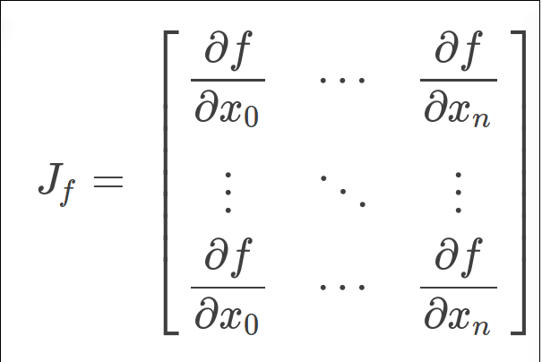
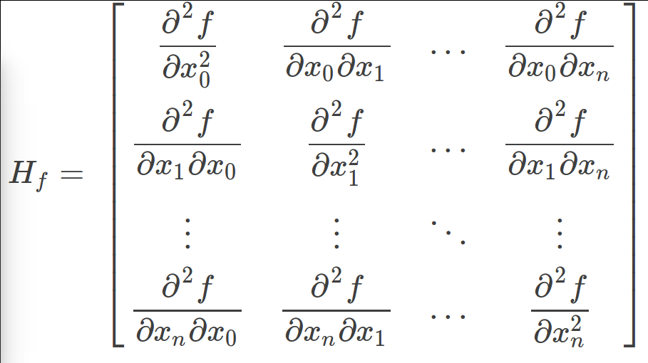

# 数学知识点滴
## 协方差 协方差矩阵
[协方差](https://www.zhihu.com/question/20852004/answer/134902061)
> 协方差是变量间的相关关系  Conv(X,Y)=SUM(Xi - EX)(Yi - EY)  两个变量所有时刻点对之间的相关关系之和，

> 同一时刻你比均值大，我也比均值大，就是正相关；同一时刻你比均值小，我也比均值小，也是正相关；同一时刻一个比均值大，一个比均值小，就是负相关；

> 所有时刻的相关性加和就是两个变量之间的协方差；如果两个变量独立，那么他们之间的协方差为0，同一个变量和自身的协方差，就是方差，就是标准差平方。

[协方差矩阵](https://zhuanlan.zhihu.com/p/24650651)
> 就是多个变量，两两之间的协方差，排列成的矩阵。

> 例如两个变量之间的协方差矩阵，维度就是 2*2 

> n个变量之间的协方差矩阵，维度就是 n*n

> 例如 独立随机变量 X 和 Y 的均值为0，标准差为1 和 2，则他们的协方差矩阵 为 |1 0; 0 4|

> 再如变量 X1 X2 X3 X4 X5 C=|Conv(X1,X1) Conv(X1,X2) Conv(X1,X3) Conv(X1,X4) Conv(X1,X5);...|

> 如果 X1 , ... ,  Xn 之间独立，则他们的协方差矩阵为 diag(Conv(X1,X1),...,Conv(Xn,Xn))

> 同时如果 X1, ,...,Xn 是多维变量，则他们的协方差矩阵为 diag(C1, ..., Cn)

## 逆矩阵 伪逆矩阵  矩阵转置
[现代视频](http://www.bilibili.com/video/av6731067/index_5.html#page=1)
> 转置  列与行互换    (AB)转置 = B转置 * A转置

> 逆矩阵，非奇异方矩阵，有逆矩阵，  A的伴随矩阵 除以 A的行列式   AB=BA=E, B成为A的逆

> 伪逆矩阵，是逆矩阵的广义形式，由于 奇异矩阵(行列式值为0) 或 非方阵的矩阵 不存在逆矩阵，但是有伪逆矩阵

> 一个与A的 转置矩阵A' 同型的矩阵X，并且满足:AXA=A, XAX=X, (AX)转置=AX  (XA)转置 = XA 此时，称矩阵X为矩阵A的伪逆，也称为广义逆矩阵。

## 协方差矩阵的传播
> 如果, X 的协方差为 C

> 变量组X的线性变换，f(X) = AX，则f(X)的协方差为 A * C * A转置  = (A转置 * C逆 * A)逆 = (A转置 * C逆 * A)伪逆

> 变量组X的线性变换 F(X)，一阶偏导数矩阵(雅克比矩阵，偏导数在均值处的值)为J，则F(X)的协方差为 J * C * J转置 = (J转置 * C逆 * J)逆 = (J转置 * C逆 * J)伪逆

## 数值优化
[牛顿法 高斯牛顿法 莱文贝格－马夸特方法](http://blog.csdn.net/liu14lang/article/details/53991897)
### 牛顿法
> 一般来说我们利用牛顿法使用来求f(x)=0的解。 先对f(x)一阶泰勒展开得 

> f(x+Δ)=f(x)+f′(x)Δ=0
 
> 所以我们有   Δ = x−x0 = −f(x0) / f′(x0), 即 x = x0 − f(x0) / f′(x0) 不断迭代优化

> 因此也就得到了我们的牛顿迭代公式：  xn = xn−1 − f(xn−1) / f′(xn−1)

### 求解最优化问题
> min　f(x)  牛顿法首先则是将问题转化为求 f′(x)=0

> 这个方程的根, 一阶展开：  f′(x) ≈ f′(x0) + (x－x0)f′′(x0)

> 令  f′(x0) + (x－x0)f′′(x0) = 0

> x = x0 − f'(x0) / f′'(x0) 不断迭代优化

## 高斯牛顿法
> 在讲牛顿法的时候，我们举的例子x是一维的，若如果我们遇到多维的x该如何办呢？这时我们就可以利用雅克比，海赛矩阵之类的来表示高维求导函数了。

> 例如 求 f(X)=0, 其中X=[x0,x1,...,xn]

> 所以我们有雅克比矩阵： 

> 有海赛矩阵

> 所以高维牛顿法解最优化问题又可写成： Xn+1 = Xn −  Hf(xn)逆 * ∇ * f(xn)

> 梯度(J) 代替了低维情况中的一阶导   Hessian矩阵代替了二阶导    求逆代替了除法 

> 有海赛矩阵的雅克比近似  H ≈ J转置 * J

> 高斯牛顿 迭代公式  Xn+1 = Xn −(J转置 * J)逆 * J转置 * f(xn)

## Levenberg-Marquardt算法 莱文贝格－马夸特方法
> 莱文贝格－马夸特方法（Levenberg–Marquardt algorithm）能提供数非线性最小化（局部最小）的数值解。此算法能借由执行时修改参数达到结合高斯-牛顿算法以及梯度下降法的优点，并对两者之不足作改善（比如高斯-牛顿算法之反矩阵不存在或是初始值离局部极小值太远）

> 在高斯牛顿迭代法中，我们已经知道 Δ = − (J转置 * J)逆 * J转置 * f(xn)

> 在莱文贝格－马夸特方法算法中则是 Δ = −(J转置 * J  + λI )逆 * J转置 * f(xn)

> Levenberg-Marquardt方法的好处就是在于可以调节

> 如果下降太快，使用较小的λ，使之更接近高斯牛顿法

> 如果下降太慢，使用较大的λ，使之更接近梯度下降法

# 最小二乘图优化   
## 闭环检测
> 假设一个机器人初始起点在0处x0，然后机器人向前移动，通过编码器测得它向前移动了1m，到达第二个地点x1。

> 接着，又向后返回到x2，编码器测得它向后移动了0.8米。

> 但是，通过闭环检测，发现它回到了原始起点。

> 可以看出，编码器误差导致计算的位姿和观测到有差异，那机器人这几个状态中的位姿到底是怎么样的才最好的满足这些条件呢

> 首先构建位姿之间的关系，即图的边

> 线性方程组中变量小于方程的个数（三个未知数，四个方程），要计算出最优的结果，使出杀手锏最小二乘法。先构建残差平方和函数：

> 为了使残差平方和最小，我们对上面的函数每个变量求偏导，并使得偏导数等于0.

> 整理得到

> 接着矩阵求解线性方程组

> 所以调整以后为满足这些边的条件，机器人的位姿为：
X0 = 0, X1 = 0.93, X2 = 0.07.

> 在这里例子中我们发现，闭环检测起了决定性的作用。

## 观测的路标（landmark）
> 上面是用闭环检测，这次用观测的路标（landmark）来构建边。如下图所示，假设一个机器人初始起点在0处，并观测到其正前方2m处有一个路标。然后机器人向前移动，通过编码器测得它向前移动了1m，这时观测到路标在其前方0.8m。请问，机器人位姿和路标位姿的最优状态

> 在这个图中，我们把路标也当作了一个顶点。构建边的关系如下

> 左边-右边 得到误差方程

> 残差平方和

> 求偏导数

> 最后整理并计算得

> 得到路标和机器人位姿 
X0 = 0, X1 = 1.07, l2 = 1.93

## 边的信息矩阵 边的 权重
> 将引入了一个重要的概念。我们知道传感器的精度是有差别的，也就是说我们对传感器的相信程度应该不同。比如假设这里编码器信息很精确，测得的路标距离不准，我们应该赋予编码器信息更高的权重，假设是10。

> 重新得到残差平方和如下

> c = sum(fi) = x0^2 + 10 * (x1 - x0 - 1)^2 + (l0 - x0 -2)^2 + (l0 - x1 - 0.8)^2

> 求偏导得到

> 转换为矩阵求逆矩阵得到解
X0 = 0, X1 = 1.01, l2 = 1.9

> 将这个结果和之前对比，可以看到这里的机器人位姿x1更靠近编码器测量的结果。请记住这种思想，这里的权重就是在后面将要经常提到的边的信息矩阵。

# 图优化理论分析
[图优化理论分析](http://blog.csdn.net/heyijia0327/article/details/47731631)
 > 由以上 实例分析可得：
 
 > 目标函数

# 卡尔曼滤波器
[卡尔曼滤波](http://blog.csdn.net/heyijia0327/article/details/17487467)

# 粒子滤波器
[粒子滤波](http://blog.csdn.net/heyijia0327/article/details/40899819)

 
