# 数学知识点滴
[数学pdf　微分几何　黎曼几何　群论　流形　随机过程　概率论　图论　拓扑学](http://vdisk.weibo.com/s/qBVN187myezF0)
## 方差 协方差 协方差矩阵 协方差矩阵对角化  矩阵的迹  均方误差  高斯分布
### 方差 分散程度，可以用数学上的方差来表述。
      此处，一个字段的方差可以看做是每个元素与字段均值的差的平方和的均值，即：
      var(a) = 1/n * sum（ai - u）^2
      如果 a的每个元素已经减去其均值（简化处理） 则 var(a) = 1/n * sum(ai'^2)
### [协方差](https://www.zhihu.com/question/20852004/answer/134902061)
      从直观上说，让两个字段尽可能表示更多的原始信息，
      我们是不希望它们之间存在（线性）相关性的，
      因为相关性意味着两个字段不是完全独立，必然存在重复表示的信息。
      Cov(a,b) = 1/n * sum（ai - u）*(bi - v)
      如果两个向量均做了 去均值处理则可以写为（进行零均值化，即减去这一行的均值）
      Cov(a,b) = 1/n * sum（ai' * bi')
      可以看到，在字段均值为0的情况下，两个字段的协方差简洁的表示为其内积除以元素数m。
      当协方差为0时，表示两个字段完全独立。
      为了让协方差为0，我们选择第二个基时只能在与第一个基正交的方向上选择。
      因此最终选择的两个方向一定是正交的。
      
> 协方差是变量间的相关关系  Conv(X,Y)=SUM(E(Xi - EX)(Yi - EY))  两个变量所有时刻点对之间的相关关系 期望 之和，

> 同一时刻你比均值大，我也比均值大，就是正相关；同一时刻你比均值小，我也比均值小，也是正相关；同一时刻一个比均值大，一个比均值小，就是负相关；

> 所有时刻的相关性加和就是两个变量之间的协方差；如果两个变量独立，那么他们之间的协方差为0，同一个变量和自身的协方差，就是方差，就是标准差平方。

### [协方差矩阵](https://zhuanlan.zhihu.com/p/24650651)
> 就是多个变量，两两之间的协方差，排列成的矩阵。

> 例如两个变量之间的协方差矩阵，维度就是 2*2 

> n个变量之间的协方差矩阵，维度就是 n*n

> 例如 独立随机变量 X 和 Y 的均值为0，标准差为1 和 2，则他们的协方差矩阵 为 |1 0; 0 4|

> 再如变量 X1 X2 X3 X4 X5 C=|Conv(X1,X1) Conv(X1,X2) Conv(X1,X3) Conv(X1,X4) Conv(X1,X5);...|

> 如果 X1 , ... ,  Xn 之间独立，则他们的协方差矩阵为 diag(Conv(X1,X1),...,Conv(Xn,Xn))

> 同时如果 X1, ,...,Xn 是多维变量，则他们的协方差矩阵为 diag(C1, ..., Cn)
### 协方差矩阵对角化
      这个矩阵对角线上的两个元素分别是两个字段的方差，
      而其它元素是a和b的协方差。两者被统一到了一个矩阵的。
      我们发现要达到优化目前，等价于将协方差矩阵对角化：
      即除对角线外的其它元素化为0，并且在对角线上将元素按大小从上到下排列，
      这样我们就达到了优化目的。
      这样说可能还不是很明晰，我们进一步看下原矩阵与基变换后矩阵协方差矩阵的关系：
      
      设原始数据矩阵X对应的协方差矩阵为C，而P是一组基按行组成的矩阵，
      设Y=PX，则Y为X对P做基变换后的数据。设Y的协方差矩阵为D，我们推导一下D与C的关系：
      D = 1/m * Y * Y转置
        = 1/m *(PX)*(PX)转置
        = 1/m * PXX转置*P转置
        = P ( 1/m *XX转置)*P转置
        = P * C * P转置
#### PCA降维
      PCA（Principal Component Analysis）是一种常用的数据分析方法。

      PCA通过线性变换将原始数据变换为一组各维度线性无关的表示，

      可用于提取数据的主要特征分量，常用于高维数据的降维。
[PCA降维](http://blog.codinglabs.org/articles/pca-tutorial.html)

      PCA算法
      总结一下PCA的算法步骤：

      设有m条n维数据。

      1）将原始数据按列组成n行m列矩阵X

      2）将X的每一行（代表一个属性字段）进行零均值化，即减去这一行的均值

      3）求出协方差矩阵C=1/m*X*X转置

      4）求出协方差矩阵的特征值及对应的特征向量(奇异值分解)

      5）将特征向量按对应特征值大小从上到下按行排列成矩阵，取前k行组成矩阵P

      6）Y=PX
      即为降维到k维后的数据        

### 矩阵的迹
矩阵P的对角线元素求和，用字母T来表示这种算子，他的学名叫矩阵的迹。

###  均方误差

> 均方误差：它是"误差"的平方的期望值（误差就是每个估计值与真实值的差），也就是多个样本的时候，均方误差等于每个样本的误差平方再乘以该样本出现的概率的和。

### 矩阵线性变换
### [矩阵线性变换](http://www.ams.org/samplings/feature-column/fcarc-svd)
> 先通过两个二维的简单特例来图示线性变换的拉伸效果

> 矩阵的一列为空间的一个基底，单位阵为笛卡尔坐标系基底（相互垂直），其他矩阵(非奇异)表示的基底 都可由笛卡尔坐标系 线性变换过去

> 看一个矩阵A(基底) 乘以 向量V（记录各个轴上有多少个单位长度）

> 相当于 现在的基底 u = 3x   v=y ，（x, y）为笛卡尔坐标系单位向量

> 满秩（行满秩且列满秩）矩阵 M 

> 该基底下的 单位坐标图示

> 奇异矩阵，部分基底重合的，即，其中的某些列可以被其他列线性表示，u 和 v 重合了

> 正交矩阵，各列之间两两垂直正交，即相乘等于0，向量相乘等于0，则向量相互垂直，正交矩阵构成的基底也是相互垂直的，和笛卡尔坐标系相差一个旋转

### 矩阵和矩阵相乘
> C = A * B = A * B * I = A * W ,I为单位矩阵，也就是笛卡尔坐标系, B = W 相当于从笛卡尔坐标系I 经过B变换后得到的一组空间坐标基。

> 那么C 就是基底 B 经过 A 变换后 生成的 有一个新的基底

### 总结
      > 矩阵就是一个空间， 矩阵的每一列 都是 这个空间的一个基底，有的可能是重合的，矩阵乘法，就是在不同的基底空间中的转换表示。

      > 各个空间的维度不一定相同，如 一个 3* 2的变换矩阵 乘以一个二维空间向量 2* 1 得到一个 三维空间的向量 3 * 1 。

      > 原先 2* 2 的 变换矩阵 乘以 二维空间向量 2* 1 ，只是相当于 在一个二维平面中的变换，比如一张放在桌平面上的一张布，拉着一边拉伸变形。

      > 而 3* 2的变换矩阵 乘以一个二维空间向量 2* 1 ，从二维空间转换到了三维空间，相当于手拿着布的一点，向上提，变成了三维空间。

      > 一般而言 行列相同的变换矩阵（方阵） 对一个向量或矩阵 变换后，该矩阵或向量 的 维度不变，经过不是方阵的变换矩阵变换后维度就会发生变化

      > 矩阵的秩就是这个矩阵空间的体积，由标准空间转换过来的体积变化因子。

### 方阵 的 特征值和特征向量
#### [特征值和特征向量](http://blog.csdn.net/heyijia0327/article/details/26760737)

> 一般来说，一个向量 经过一个 变换矩阵 方阵 变换后，可以变成任意可能的向量，而改变换矩阵对应的 特征向量就不同了，该特征向量经过 变换矩阵 变换后，方向不变（也可能相反，在同一条直线上），仅仅是大小和之前相差一个系数,只是大小的缩放(相似变换)，该系数成称为该变换矩阵的特征值。

> 空间变换角度理解  A * V = a * V = a * I * A ,向量 V在空间A中的表示，与 向量V在 笛卡尔坐标系下的表示，方位不变，大小不同，也就是说，特征向量相当于一根轴线，使得轴上的点 在笛卡尔坐标系空间和 矩阵A空间的表示下 都不会离开轴，知识在轴上移动，而两个变换表示相差的尺度就是特征值。

> 类似 旋转向量的概念，笛卡尔坐标系下的坐标 进旋转轴 l,旋转一个角度c后变换到另一个空间 A矩阵，则该旋转轴l(向量)为矩阵A的特征向量

> 笛卡尔坐标I 和 矩阵B

 
> 表示的空间, 矩阵 B的特征向量为 （0.707,0.707） 和 （-0.707,0.707），为矩阵 I 和矩阵 B表示的空间的轴对称线，对称矩阵表示的是对称的空间，这里 实对称矩阵 属于不同特征值的特征向量一定正交。

> 不同特征值的特征向量都是 线性无关的，也就是说不同特征值组成的特征向量组构成了特征向量的一组基底

> n阶方阵 A 若有 n个 线性无关的 特征向量，那么 A 可以被对角化为 A = P逆 * 上  * P , 矩阵P为特征向量矩阵

#### SVD奇异值分解
> SVD分解就是把一个 实数矩阵M 分拆成UDV = IUDV 。U，V都是正交旋转矩阵。这个分拆可以形象的理解为，我要看看这个空间M性质怎么样？

> 那我可以用标准笛卡尔空间来构造出一个一模一样的M空间。想象M空间是个特殊形状的泥塑，笛卡尔空间 I 是块标准的正方形泥块。

> 把笛卡尔空间 I 放在手里，先旋转着看看(即左乘V)，再找合适的地方捏捏它(伸缩变形)(再左乘D)，好让它和M一样。

> 最后再旋转(再左乘U)，把它摆得和M一样。这样就360度无死角的构造了一个M空间。

> 如果发现M空间有的地方很扁，那么我就掉丢这个维度，这就是SVD的降维，也是SVD的核心。

#### [奇异值分解](http://blog.csdn.net/heyijia0327/article/details/26762531)

##  概率（probabilty）和统计（statistics）看似两个相近的概念，其实研究的问题刚好相反。
###  A. 概率研究的问题是，已知一个模型和参数，怎么去预测这个模型产生的结果的特性（例如均值，方差，协方差等等）。
[参考](https://blog.csdn.net/u011508640/article/details/72815981)

      举个例子，
      1. 我想研究怎么养猪（模型是猪），
      2. 我选好了想养的品种、喂养方式、猪棚的设计等等（选择参数），
      3. 我想知道我养出来的猪大概能有多肥，肉质怎么样（预测结果）。
      
### B. 统计研究的问题则相反。统计是，有一堆数据，要利用这堆数据去预测模型和参数。
      仍以猪为例。
      1. 现在我买到了一堆肉，
      2. 通过观察和判断，我确定这是猪肉
      （这就确定了模型。在实际研究中，也是通过观察数据推测模型 是 高斯分布? 指数分布? 拉普拉斯分布? ），
      3. 然后，可以进一步研究，判定这猪的品种、这是圈养猪还是跑山猪还是网易猪，等等（推测模型参数）。
      
###  C. 一句话总结：
      概率是已知模型和参数，推数据。
      统计是已知数据，推模型和参数。
      
### 贝叶斯公式到底在说什么
      1. 条件概率： 
                  P(A/B) = P(AB)/P(B)  B事件发生的条件下， A事件发生的概率

      2. 乘法公式： 
                  可以由条件概率得到 P(AB) = P(A/B) * P(B) = P(AB)/P(A) * P(A) = P(B/A) * P(A)
                  AB事件都发生的概率 = B发生下A也发生 = A发生下B也发生
      3. 全概率公式： 
                  S为全集，B1,...Bn为S集合的一个全划分
                  P(A) = P(AS)=P(A(B1+B2+...+BN)) = P(AB1)+...+P(ABn)
                       = P(A/B1)P(B1) + ... + P(A/Bn)P(Bn)
                       = sum(P(A/Bi) * P(Bi))
      4.贝叶斯公式：
                 P(Bi/A) = P(ABi)/P(A)                          条件概率 + 
                         = P(A/Bi)P(Bi)/P(A)                    乘法公式 +
                         = P(A/Bi)P(Bi)/(sum(P(A/Bi) * P(Bi)))  全概率公式

      意思就是说 有多种情况可以导致 观测事件A发生，需要求当观测到 事件A发生了，由事件B1引发的概率（P(B1/A)）
      但是直接求不容易求解，可以转化成 在原因事件Bi发生下，结果事件A发生的概率来联合求解。

      例如，观测到 汽车报警响了A，可能由 行人误碰 引起B1，也可能真是由于小偷偷车引起B2

      一般情况下：
      行人误碰 B1 事件发生的概率为 0.7
      小偷偷车 B2 事件发生的概率为 0.3

      而 行人误碰事件B1发生下 汽车发出声响的概率为 0.6  不发出声响的概率为 0.4
      而 小偷偷车事件B2发生下 汽车发出声响的概率为 0.4  不发出声响的概率为 0.6

      当 观测到 汽车报警响了 事件A发生，求是由于小偷偷车引起的概率

      P(B2/A) = P(AB2)/P(A) 
              = P(A/B2) * P(B2)/( P(A/B1)* P(B1) + P(A/B2)* P(B2) )
              = 0.4 * 0.3 / (0.7 * 0.6 + 0.3 * 0.4 )
              = 0.2222222
### 似然函数（likelihood function）  似然（likelihood）这个词其实和概率（probability）是差不多的意思

      1. P(X | O) 表示一个概率， X是一个数据， O是模型参数；
      2. 模型参数O已知， 数据X是变量，已知模型参数，求不同数据样本点出现的概率，是概率函数，是用来确定发生概率最大的数据；
      3. 数据X已知， 模型参数O是变量，已知数据X出现，求这个数据符合不同模型参数的概率，是似然函数，是用来估计模型参数的。

###  最大似然估计（Maximum likelihood estimation, 简称MLE）
      已知数据，模型参数为变量，求使得函数值最大的，模型参数。
      例如：
      1. 有一枚硬币，我们想确定这枚硬币（模型对象）是否是均匀的（抛出来正反面概率一致，模型参数）
      2. 我们需要获取数据，于是我们那这枚硬币抛了10次，得到数据X0是：反正正正正反正正正反。
      3. 假设出现正面的概率为O，是模型参数，且反面概率为 1-O （假设为二项分布，不会出现站立的情况）
      4. 那么出现这个数据的概率输是 f(x0,O) = (1-O)OOOO(1-O)OOO(1-O) = O^7 * (1-O)^3
      5. 该似然函数 f(x0,O)，是一个关于O的函数f(O)，最大似然的意思就是要最大化这个函数
      6. 可以画出f(O)的图象，可以得到 在 O = 0.7的时候，似然函数取得最大值
      
      结论：
      做10次实验，有7次正面向上，最大使然认为正面向上的概率是 0.7. 有点不太合理...? 贝叶斯学派就提出了异议
### 最大后验概率估计（Maximum a posteriori estimation, 简称MAP）
      考虑先验概率分布。 为此，引入了最大后验概率估计。

      1. 最大似然估计     是求参数O，  使得 似然函数概率 P(X | O)最大
      2. 最大后验概率估计  是求参数O，  使得 函数概率 P(X | O) * P(O)最大   也就是 P(O|X0) 后验概率最大 
      思想：
         求得的O，不单单让似然函数最大，O自己出现的概率也要比较大才可以；
         有点像正则化里的 加参数惩罚项的思想（让在参数较小的情况下，参数组成的损失函数也比较小）
         不过正则化里是利用  加法 (因为是最小化，两者都比较小，其和才比较小)
         而 最大后验概率估计 MAP 是利用 乘法(两个都比较大，乘积才比较大)
      其实有点 与门的思想， 要使得 两个量运算之后在两者都较小的情况下取得最小值，使用加法，
          两个都较小相加之后还是比较小，如果一个大一个小，相乘之后，积还是比较小，所以要使得三者都比较小，使用 加法 运算
      要使得三者都比较大，使用乘法运算，
          两个都比较大，相乘之后还是比较大，一个较大一个较小，相乘之后就比较小；而一个较大一个较小，相加之后比较大。

      MAP其实是在 最大化 P(O|X0) = P(X0|O)*P(O)/P(X0) 
      因为 X0 是确定的 在总实验次数下 出现X0数据的概率是可以有实验数据确定性得到的，所以就不考虑分母了

      P(O|X0) 就是数据X0已经出现了，要就O去什么值使得 P(O|X0) 后验概率 最大
      
### 模型参数 的先验知识
      由先验知识（常识）知道 模型参数O 取的 0.5 的概率最大，所以我们可以假设，P(O)符合均值为0.5 方差为 0.1的高斯分布
      也就是 在 0.5 出概率最大，两边逐渐减小
      
      P(O) =  1/(sqrt(2*pi)*方差) * exp(-(O - 均值)^2/(2*方差^2))
           =  1/(sqrt(2*pi)*0.1) * exp(-(O - 0.5)^2/(2*0.1^2))
           
       P(X0 | O) * P(O) 的图像 开口向下 峰值横坐标 由0.7 向 0.5 偏移
       得到在 O = 0.558的情况下 后验概率  P(O|X0) 最大
#### 总结
       1. 最大后验概率估计MAP 比最大似然估计MLE 对了一个作为乘法因子的 先验概率 P(O)
       2. 或者也可以认为，MLE 相对于 MAP 是把 先验概率 P(O) = 1，即认为 模型参数O 是均匀分布
         

### 高斯分布
#### 一维高斯分布
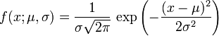

> 均值u, 标准差 西格玛，方差 西格玛平方

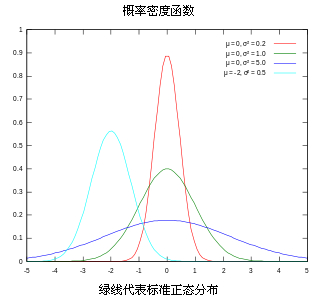

> 均值u 决定了 曲线在 坐标轴上的位置, 方差 决定了曲线的形状，方差越大，数据间差异越大，分布越广泛，曲线矮胖，反之，数据集中分布，曲线瘦高。

#### 多维高斯分布
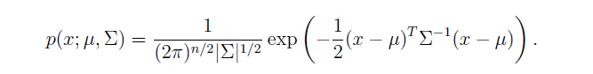

> 均值u 为n * 1的向量，n为维度数, 一维的方差 变成了多维度向量之间的协方差矩阵, 协方差求逆，代替了 一维 除以方差， 多维时 x-u为矩阵形式(其实为向量)，一维时直接平方即可，多维时，需要 矩阵转置 * 矩阵。

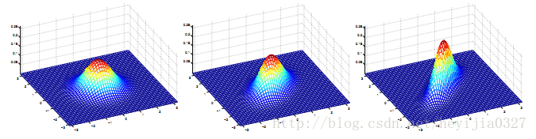

> 对应的协方差矩阵如下：

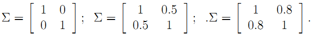

> 协方差矩阵的主对角线，是各个变量本身的 方差，其余反应个变量之间的相关关系, 就上面的二元高斯分布而言，协方差越大，图像越扁，也就是说两个维度之间越有联系。

## 逆矩阵 伪逆矩阵  矩阵转置
[现代视频](http://www.bilibili.com/video/av6731067/index_5.html#page=1)
> 转置  列与行互换    (A * B)转置 = B转置 * A转置 ，(A + B)转置 = A转置 +  B转置， (K * A)转置=K* A转置， A转置 * B = (B转置 * A)转置
 
> 逆矩阵，非奇异方矩阵，有逆矩阵，A的伴随矩阵 除以 A的行列式，AB=BA=E, B成为A的逆, A逆的逆=A ，A逆的转置 = A转置的逆， (AB)逆 = B逆* A逆

> 伪逆矩阵，是逆矩阵的广义形式，由于 奇异矩阵(行列式值为0) 或 非方阵的矩阵 不存在逆矩阵，但是有伪逆矩阵

> 一个与A的 转置矩阵A' 同型的矩阵X，并且满足:AXA=A, XAX=X, (AX)转置=AX  (XA)转置 = XA 此时，称矩阵X为矩阵A的伪逆，也称为广义逆矩阵。

## 协方差矩阵的传播
> 如果, X 的协方差为 C

> 变量组X的线性变换， f(X) = AX，则f(X)的协方差为 A * C * A转置  = (A转置 * C逆 * A)逆 = (A转置 * C逆 * A)伪逆

> 变量组X的非线性变换 F(X)，一阶偏导数矩阵(雅克比矩阵，偏导数在均值处的值)为J，则F(X)的协方差为 J * C * J转置 = (J转置 * C逆 * J)逆 = (J转置 * C逆 * J)伪逆

## 数值优化
[牛顿法 高斯牛顿法 莱文贝格－马夸特方法](http://blog.csdn.net/liu14lang/article/details/53991897)
### 牛顿法
> 一般来说我们利用牛顿法使用来求f(x)=0的解。 先对f(x)一阶泰勒展开得 

> f(x+Δ)=f(x)+f′(x)Δ=0，  f'(x)为斜率 tan(a) 对边长度 = 斜率×直角边 = f'(x)×Δ

                   |
                   |
            |——————
            f(x0)  f(x0+Δ)
 
> 所以我们有   Δ = x−x0 = −f(x0) / f′(x0), 即 x = x0 − f(x0) / f′(x0) 不断迭代优化

> 因此也就得到了我们的牛顿迭代公式：  xn = xn−1 − f(xn−1) / f′(xn−1)

####  牛顿下山法  逐次 减小 变化调整
      有 Δ = x−x0 = −f(x0) / f′(x0), 即 x = x0 − f(x0) / f′(x0) 不断迭代优化
      为了保证每次 变化的量逐渐变小  加入逐渐变小的变化率 W (W=1 后逐次减半)
      即 x = x0 −  W * f(x0) / f′(x0) 不断迭代优化   (W=1 后逐次减半)
      为减弱牛顿法对初始近似
      
#### 动量法加入之前的一次变化
#### momentum 想象一个铁球下山 速度回越来越快 重力势能转换成 速度动能   考虑上次的速度
      Δt  = Q * Δt-1  + W * (f(x0) / f′(x0)) 更新速度 会越来越快  有可能到了山底停不下来(冲过了)
      Δt  = Q * Δt-1  + W * (f(x0)) * J(x0) 当前点算梯度
      xt  =  xt-1 - Δt  
#### 动量法的改进
      Δt  = Q * Δt-1  + W * (-f(x0)) * J(x0 - Q * Δt-1)  向前走一步后(x0 - Q * Δt-1) 再算梯度

#### 自动参数调整  之前调整量小的 下一次更新越多  之前更新量大的 下一次更新越少  平方和
      每个参数的梯度 g
      梯度历史矩阵   G = SUM(g^2)  记录每个参数 之前更新的量  平方和
      更新参数      xt  =  xt-1 - W * (1/G) * g
      存在的问题    更新衰减太快
      
#### 使用移动平均的梯度平方 来决定更新参数的更新量
      每个参数的梯度 g
      移动平方均值   Et(g^2) = t * Et-1(g^2) + ( 1 - t) * g^2
      更新参数      xt  =  xt-1 - W * (1/E) * g
      存在的问题    单位不匹配

#### 既考虑前一次更新量（动量 方向信息） 也考虑了之前所有更新量的平方和 作为衰减信息
      梯度  gt
      动量  mt = r * mt-1  + (1-r) * gt     梯度自身求和 相当于 一阶矩 
      衰减  vt = t * vt-1  + (1-t) ) gt^2   梯度平方求和 相当于 二阶矩
           // 这里的求和方法 类似传感器滤波的 数值滤波方法  
           // float tep=0.0; tep = (tep + 5 * sensor_dat)/6.0; 这里的权重分别为 1/6  和 5/6  和为1
      更新  xt  =  xt-1  - W * (1/vt) * mt

#### 神经网络 反向传播
[台大视频参考](http://speech.ee.ntu.edu.tw/~tlkagk/courses/MLDS_2015_2/Lecture/DNN%20backprop.ecm.mp4/index.html)

      
### 求解最优化问题
> min　f(x)  牛顿法首先则是将问题转化为求 f′(x)=0

> 这个方程的根, 一阶展开：  f′(x) ≈ f′(x0) + (x－x0)f′′(x0)

> 令  f′(x0) + (x－x0)f′′(x0) = 0

> x = x0 − f'(x0) / f′'(x0) 不断迭代优化

## 高斯牛顿法
> 在讲牛顿法的时候，我们举的例子x是一维的，若如果我们遇到多维的x该如何办呢？这时我们就可以利用雅克比，海赛矩阵之类的来表示高维求导函数了。

> 例如 求 f(X)=0, 其中X=[x0,x1,...,xn]

> 所以我们有雅克比矩阵： 

> 有海赛矩阵

> 所以高维牛顿法解最优化问题又可写成： Xn+1 = Xn −  Hf(xn)逆 * ∇ * f(xn)

> 梯度(J) 代替了低维情况中的一阶导   Hessian矩阵代替了二阶导    求逆代替了除法 

> 有海赛矩阵的雅克比近似  H ≈ J转置 * J

> 高斯牛顿 迭代公式  Xn+1 = Xn −(J转置 * J)逆 * J转置 * f(xn)

## Levenberg-Marquardt算法 莱文贝格－马夸特方法
> 莱文贝格－马夸特方法（Levenberg–Marquardt algorithm）能提供数非线性最小化（局部最小）的数值解。此算法能借由执行时修改参数达到结合高斯-牛顿算法以及梯度下降法的优点，并对两者之不足作改善（比如高斯-牛顿算法之反矩阵不存在或是初始值离局部极小值太远）

> 在高斯牛顿迭代法中，我们已经知道 Δ = − (J转置 * J)逆 * J转置 * f(xn)

> 在莱文贝格－马夸特方法算法中则是 Δ = −(J转置 * J  + λI )逆 * J转置 * f(xn)

> Levenberg-Marquardt方法的好处就是在于可以调节

> 如果下降太快，使用较小的λ，使之更接近高斯牛顿法

> 如果下降太慢，使用较大的λ，使之更接近梯度下降法

# 最小二乘图优化   
## 闭环检测
> 假设一个机器人初始起点在0处x0，然后机器人向前移动，通过编码器测得它向前移动了1m，到达第二个地点x1。

> 接着，又向后返回到x2，编码器测得它向后移动了0.8米。

> 但是，通过闭环检测，发现它回到了原始起点。

> 可以看出，编码器误差导致计算的位姿和观测到有差异，那机器人这几个状态中的位姿到底是怎么样的才最好的满足这些条件呢

> 首先构建位姿之间的关系，即图的边

> 线性方程组中变量小于方程的个数（三个未知数，四个方程），要计算出最优的结果，使出杀手锏最小二乘法。先构建残差平方和函数：

> 为了使残差平方和最小，我们对上面的函数每个变量求偏导，并使得偏导数等于0.

> 整理得到

> 接着矩阵求解线性方程组

> 所以调整以后为满足这些边的条件，机器人的位姿为：
X0 = 0, X1 = 0.93, X2 = 0.07.

> 在这里例子中我们发现，闭环检测起了决定性的作用。

## 观测的路标（landmark）
> 上面是用闭环检测，这次用观测的路标（landmark）来构建边。如下图所示，假设一个机器人初始起点在0处，并观测到其正前方2m处有一个路标。然后机器人向前移动，通过编码器测得它向前移动了1m，这时观测到路标在其前方0.8m。请问，机器人位姿和路标位姿的最优状态

> 在这个图中，我们把路标也当作了一个顶点。构建边的关系如下

> 左边-右边 得到误差方程

> 残差平方和

> 求偏导数

> 最后整理并计算得

> 得到路标和机器人位姿 
X0 = 0, X1 = 1.07, l2 = 1.93

## 边的信息矩阵 边的 权重
> 将引入了一个重要的概念。我们知道传感器的精度是有差别的，也就是说我们对传感器的相信程度应该不同。比如假设这里编码器信息很精确，测得的路标距离不准，我们应该赋予编码器信息更高的权重，假设是10。

> 重新得到残差平方和如下

> c = sum(fi) = x0^2 + 10 * (x1 - x0 - 1)^2 + (l0 - x0 -2)^2 + (l0 - x1 - 0.8)^2

> 求偏导得到

> 转换为矩阵求逆矩阵得到解
X0 = 0, X1 = 1.01, l2 = 1.9

> 将这个结果和之前对比，可以看到这里的机器人位姿x1更靠近编码器测量的结果。请记住这种思想，这里的权重就是在后面将要经常提到的边的信息矩阵。

# 图优化理论分析
[图优化理论分析1](http://blog.csdn.net/heyijia0327/article/details/47731631)
[图优化理论分析2](http://www.cnblogs.com/gaoxiang12/p/5244828.html)
 > 由以上 实例分析可得：
 
 > 目标函数
 

   > e 函数在原理上表示一个误差，是一个矢量，作为优化变量Xk和 实际值Zk符合程度的一个度量。
   
   > 它越大表示xk越不符合zk。但是，由于目标函数必须是标量，所以必须用它的平方形式来表达目标函数。
   
   > 最简单的形式是直接做成平方：e(x,z)转置 * e(x,z)。  

> 进一步，为了表示我们对误差各分量重视程度的不一样，还使用一个信息矩阵 Ω 来表示各分量的不一致性。

> 信息矩阵 Ω 是协方差矩阵(ei 与 ej的相关性)的逆(即相关性越高，该误差项权重越小，或是 与该误差项(边)的变量的准确度相关)，是一个对称矩阵。由于图优化里每一条边代表一个测量值，如表示相邻位姿关系的编码器测量值 或者 图像（激光）匹配得到的位姿变换矩阵。所以图优化里每一条边的信息矩阵就是这些测量协防差矩阵的逆。如果协防差越小，表示这次测量越准越值得相信，信息权重就越大。

> 它的每个元素Ωi,j作为ei, ej的系数，可以看成我们对ei,ej这个误差项相关性的一个预计。

> 最简单的是把Ω设成对角矩阵（各误差间独立），对角阵元素的大小表明我们对此项误差的重视程度。

> 这里的Xk可以指一个顶点、两个顶点或多个顶点，取决于边的实际类型。

> 所以，更严谨的方式是把它写成ek(Zk,Xk1,Xk2,…)，但是那样写法实在是太繁琐，我们就简单地写成现在的样子。

> 由于Zk是已知的，为了数学上的简洁，我们再把它写成ek(Xk)的形式。

> 于是总体优化问题变为n条边加和的形式：

> 边的具体形式有很多种，可以是一元边、二元边或多元边，它们的数学表达形式取决于传感器或你想要描述的东西。

> 例如视觉SLAM中，在一个相机Pose Tk 处对空间点xk进行了一次观测，得到zk，那么这条二元边的数学形式即为:

> 单个边其实并不复杂。

> 可以使用 高斯牛顿法进行迭代优化，需要知道 两样东西：一个初始点和一个迭代方向。为了数学上的方便，先考虑第k条边ek(Xk)吧。

> 我们假设它的初始点为x˜k，并且给它一个Δx的增量，那么边的估计值就变为Fk(x˜k + Δx)，而误差值则从 ek(x˜k) 变为 ek(x˜k + Δx)。

> 首先对误差项进行一阶展开：

> 这是的Jk是ek关于Xk的导数，矩阵形式下为雅可比阵。

> 我们在估计点附近作了一次线性假设，认为函数值是能够用一阶导数来逼近的，当然这在Δx很大时候就不成立了。

> 于是，对于第条边的目标函数项，进一步展开：

> 其中，矩阵转置性质  (A * B)转置 = B转置 * A转置；(A + B)转置 = A转置 + B转置；(K * A)转置=K* A转置；A转置 * B = (B转置 * A)转置

> 在熟练的同学看来，这个推导就像(a+b)^2=a^2 + 2ab + b^2一样简单。

> 最后一个式子是个定义整理式，我们把和Δx无关的整理成常数项 Ck，把一次项系数写成 2 * bk ，二次项则为 Hk（注意到二次项系数其实是Hessian矩阵），bk = ek转置 * Ω * J ,  Hk =  J转置* Ω * J  。

> 请注意 Ck 实际就是该边变化前的取值。所以在xk发生增量后，目标函数Fk项改变的值即为:

> ΔFk = 2 * bk * Δx + Δx转置 * Hk * Δx

> 我们的目标是找到Δx，使得这个增量变为极小值（Fk最小 不发生变化）。所以直接令它对于Δx的导数为零，有：

> dFk / dΔx = 2 * b + 2 * Hk * Δx = 0  得到 Hk * Δx  = −bk

> 所以归根结底，我们求解一个线性方程组：Hk * Δx = −bk，   Δx = - Hk逆 * bk = -(J转置* Ω * J)逆 * ek转置 * Ω * J 高斯牛顿迭代

> 莱文贝格－马夸特迭代Δx = -(Hk + a * I) 逆 * bk = -(J转置* Ω * J + a * I )逆 * ek转置 * Ω * J , 引入一个松弛因子来控制迭代速度

> x* = x' +  Δx，这里的加法不是简单的加法，是一个增量来更新 X ,这里需要指定更新方式。

> 如果把所有边放到一起考虑进去，那就可以去掉下标，直接说我们要求解  : H * Δx = −b.   b里面含有一个雅克比矩阵，  Δx的系数为海塞矩阵

> 一阶导雅克比矩阵 和二阶导海塞矩阵 均为稀疏的矩阵，即大部分是零元素。 Jk = (0 ··· 0 Jk1 ··· Jki ··· 0 ··· Jkq0 ··· 0)

> 这种稀疏性能很好地帮助我们快速求解上面的线性方程。稀疏代数库包括SBA、PCG、CSparse、Cholmod等等。g2o正是使用它们来求解图优化问题的。

> 在数值计算中，我们可以给出雅可比和海塞的解析形式进行计算，也可以让计算机去数值计算这两个阵，而我们只需要给出误差的定义方式即可。

## 流形
> 给目标函数F(x)一个增量Δx时，直接就写成了F(x+Δx)。但是这个加法可能没有定义！

> 最简单的就是常见的四维变换矩阵T或者三维旋转矩阵R。

> 它们对加法并不封闭，因为两个变换阵之和并不是变换阵，两个正交阵之和也不是正交阵。

> 它们乘法的性质非常好，但是确实没有加法，所以也不能像上面讨论的那样去求导。

> 虽然李群 SE(3) 和 SO(3) 是没有加法的，但是它们对应的李代数 se(3),so(3) 有啊！ 

> 我们可以求它们在正切空间里的流形上的梯度！ 我们就说，通过指数变换先把变换矩阵和旋转矩阵转换成李代数，在李代数上进行加法，

> 然后通过对数变换再转换到原本的李群中。这样我们就完成了求导。

## 多视角几何 

[跟我一起学Multiple View Geometry多视图几博客](https://blog.csdn.net/fk1174/article/details/51811644)

[读书笔记](https://blog.csdn.net/serenitymk/article/category/7574945)

[多视图几何 TUM 课](https://blog.csdn.net/u011306452)

[德国慕尼黑工业大学(TUM)计算机视觉组](https://vision.in.tum.de/research/vslam/lsdslam)

[多视角几何百度文库搜索](https://wenku.baidu.com/search?word=%BC%C6%CB%E3%BB%FA%CA%D3%BE%F5%D6%D0%B5%C4%B6%E0%CA%D3%CD%BC%BC%B8%BA%CE&lm=0&od=0&fr=top_home&ie=gbk)

## 核函数
> 核函数保证每条边的误差不会大的没边，剔除误差较大的边。

> 具体的方式是，把原先误差的二范数度量，替换成一个增长没有那么快的函数，同时保证自己的光滑性质（不然没法求导啊！）。

> 因为它们使得整个优化结果更为鲁棒，所以又叫它们为robust kernel（鲁棒核函数）。

## 最后总结一下做图优化的流程

    1. 选择你想要的图里的节点与边的类型，确定它们的参数化形式；
    2. 往图里加入实际的节点和边；
    3. 选择初值，开始迭代；
    4. 每一步迭代中，计算对应于当前估计值的雅可比矩阵和海塞矩阵；
    5. 求解稀疏线性方程Hk * Δx = −bk, 得到梯度方向Δx ；
    6. 继续用 高斯牛顿GN 或 莱文贝格－马夸特方法LM进行迭代。如果迭代结束，返回优化值。
　  　实际上，g2o能帮你做好第3-6步，你要做的只是前两步而已。

# 卡尔曼滤波器
[卡尔曼滤波](http://blog.csdn.net/heyijia0327/article/details/17487467)

## 线性系统的状态差分方程    系统预测  = A 转换矩阵1 * 上次状态  + B 转换矩阵2 * 输入  + Q 噪声1
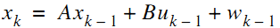

> 其中x是系统的状态向量，大小为n * 1 列。A为转换矩阵，大小为 n * n。u为系统输入，大小为 k * 1。B是将输入转换为状态的矩阵，大小为n * k。随机变量w为系统噪声。注意这些矩阵的大小，它们与你实际编程密切相关。

### 看一个具体的匀加速运动的实例
> 有一个匀加速运动的小车，它受到的合力为 ft , 由匀加速运动的位移和速度公式，能得到由 t-1 到 t 时刻的位移和速度变化公式
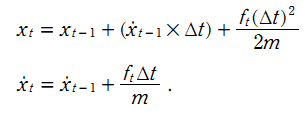

> 位移x = 位移x + （速度v + 加速度* 时间/2）* 时间 ； 加速度 = 外力 f / 质量 m  ； 速度v = 速度v + 加速度 * 时间

> 该系统的状态向量包括位移和速度，分别用 xt 和 xt的导数 表示。控制输入变量为u=f/m，也就是加速度，于是有如下矩阵形式
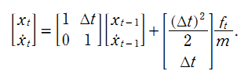

> 这里对应的的矩阵A大小为 2 * 2 , 矩阵B大小为 2 * 1。 

> 貌似有了这个模型就能完全估计系统状态了，速度能计算出，位移也能计算出。那还要卡尔曼干嘛，问题是很多实际系统复杂到根本就建不了模。并且，即使你建立了较为准确的模型，只要你在某一步有误差，由递推公式，很可能不断将你的误差放大A倍（A就是那个状态转换矩阵），以至于最后得到的估计结果完全不能用了。

> 既然如此，我们就引进反馈。从概率论贝叶斯模型的观点来看前面预测的结果就是先验，测量出的结果就是后验。

## 测量值的预测   =  H 转换矩阵3 * 系统预测值 + R 噪声2
> 测量值是由系统状态变量映射出来的:
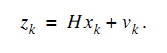

> 注意Z是测量值，大小为m * 1(不是n * 1，也不是1 * 1，后面将说明），H也是状态变量到测量量的转换矩阵。大小为m * n。随机变量v是测量噪声。

>同时对于匀加速模型，假设下车是匀加速远离我们，我们站在原点用超声波仪器测量小车离我们的距离。

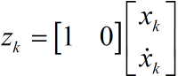

> 也就是测量值直接等于位移。可能又会问，为什么不直接用测量值呢？测量值噪声太大了，根本不能直接用它来进行计算。试想一个本来是朝着一个方向做匀加速运动的小车，你测出来的位移确是前后移动（噪声影响），只根据测量的结果，你就以为车子一会往前开一会往后开。
对于状态方程中的系统噪声w和测量噪声v，假设服从如下多元高斯分布，并且w,v是相互独立的。其中Q系统噪声,R为测量噪声变量的协方差矩阵。

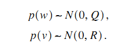

> 对于小车匀加速运动的模型，假设系统的噪声向量只存在速度分量上，且速度噪声的方差是一个常量0.01，位移分量上的系统噪声为0。

> 测量值只有位移，它的协方差矩阵R 大小是1 * 1，就是测量噪声的方差本身, 而系统噪声协方差矩阵为：

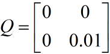

> Q中，叠加在速度上系统噪声方差为0.01，位移上的为0，它们间协方差为0，即噪声间没有关联。

## 系统估计值 = 系统状态方程预测值 + 增益系数 * (真实测量值 - 测量值预测值)
> 理论预测（先验）有了，测量值（后验）也有了，那怎么根据这两者得到最优的估计值呢？首先想到的就是加权，或者称之为反馈。由一般的反馈思想我们得到估计值：
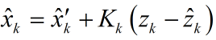

## 增益系数的求解  
> 列出 系统估计值的 协方差矩阵 Pk+1 的公式 包含 增益 K 和  系统预测值 的协方差矩阵 Pk' 测量转移矩阵 H  测量过程噪声协方差 R
> 求取  Pk+1 对角线 的和 （矩阵的迹，方差的和），求导等于0，使得估计值和真实值误差最小
> 得到 增益 K =  Pk' * H转置 * (H* Pk' * H转置 + R)逆

## 系统预测值 的协方差矩阵    Xk' = A * Xk  + Q ; Q为系统噪声协方差
> 上次 估计值和真实值间误差的协方差矩阵 Pk
> 由协方差的传递公式得到   本次 系统预测值Xk' 的协方差矩阵 Pk' = A * Pk * A转置 + Q(相当于乘以系数的平方，方差为 误差的平方)

## 系统估计值的 协方差矩阵   Xk+1 = Xk'  + K * （真实测量值 - H * Xk' ）
> 系统预测值 Xk' 的协方差矩阵 为 Pk'
> 系统估计值 Xk+1 的 协方差矩阵  Pk+1 = Pk' + K * H * Pk' =  ( I + K * H) * Pk'

里总结下递推的过程，理一下思路：

      【1】首先要计算预测值、预测值和真实值之间误差协方差矩阵。
             预测值       Xk' =  A * Xk  + B * Uk  + Q ; A 为系统状态转移矩阵 ， B为系统输入转移矩阵 Q为系统噪声协方差
             预测值协方差  Pk' =  A * Pk * A转置  + Q   ; Pk 为上次估计值的协方差           
      【2】计算卡尔曼增益K，再然后得到估计值
             卡尔曼增益    K =  Pk' * H转置 * (H* Pk' * H转置 + R)逆  ; H 为测量转移矩阵， R为测量噪声协方差
             估计值       Xk+1 = Xk'  + K * （真实测量值 - 测量预测值 ）= Xk+1 = Xk'  + K * （真实测量值 - H * Xk' ）        
      【3】  最后还要计算估计值和真实值之间的误差协方差矩阵，为下次递推做准备
             估计值协方差  Pk+1 = Pk' + K * H * Pk' =  ( I + K * H) * Pk'
 
## matlab 小车匀加速 程序示例：

         clc  
         clear all  
         close all  

         % 初始化参数  
         delta_t=0.1;   %采样时间  
         t=0:delta_t:5;  
         N = length(t); % 序列的长度  
         sz = [2,N];    % 信号需开辟的内存空间大小  2行*N列  2:为状态向量的维数n   位移 速度
         g=10;          % 加速度值   
         x=1/2*g*t.^2;  % 实际真实位置序列
         z = x + sqrt(10).*randn(1,N); % 仿真 的 测量值 测量时加入测量白噪声 测量噪声 方差为 10  均值为0 

         Q =[0 0;0 9e-1]; % 系统噪声协方差 假设建立的模型  噪声方差叠加在速度上 大小为n*n方阵 n=状态向量的维数=2
         R = 10;          % 位置测量协方差估计，可以改变它来看不同效果  m*m      m=z(i)的维数  一个测量值

        % n*n 状态 转移 矩阵  x = x * 1 + v * delta_t  + 1/2*delta_t^2 *g ;  v = x * 0  + v * 1 + delta_t*g
         A=[1 delta_t;0 1];  
         B=[1/2*delta_t^2;delta_t];  
         H=[1,0];         % m*n   测量转移矩阵   z = 1 * x + 0 * v  + 噪声

         n=size(Q);  %n为一个1*2的向量  Q为方阵  
         m=size(R);  

         % 分配空间  
         xhat=zeros(sz);       % x的后验估计        状态估计值 
         P=zeros(n);           % 后验方差估计  n*n  状态估计值 协方差
         xhatminus=zeros(sz);  % x的先验估计        状态 预测值  
         Pminus=zeros(n);      % n*n               状态 预测值 协方差
         K=zeros(n(1),m(1));   % Kalman增益  n*m   n 为 系统状态数量  m为 测量变量的维数 
         I=eye(n);  

         % 估计的初始值都为默认的0，即P=[0 0;0 0],xhat=0  
         % P=[2 0;0 2] //系统初始方差较大 算出来的 增益 K 就大，增益K 是测量真值 和 测量预测值 误差的系数 ，所以更相信测量值
         for k = 9:N           %假设车子已经运动9个delta_T了，我们才开始估计   
             % 时间更新过程  
             xhatminus(:,k) = A * xhat(:,k-1) + B*g;  // 系统噪声均值为0  协方差 为 Q
             Pminus= A * P * A' + Q;

             % 测量更新过程  
             K = Pminus*H'*inv( H*Pminus*H'+R );  
             xhat(:,k) = xhatminus(:,k)+K*(z(k)-H*xhatminus(:,k));   // 测量 噪声均值为0  协方差 为 R
             P = (I-K*H)*Pminus;  
         end  

         figure  
         plot(t,z);  
         hold on  
         plot(t,xhat(1,:),'r-')  
         plot(t,x(1,:),'g-');  
         legend('含有噪声的测量', '后验估计', '真值');  
         xlabel('Iteration');  

# 粒子滤波器
[粒子滤波](http://blog.csdn.net/heyijia0327/article/details/40899819)

 
